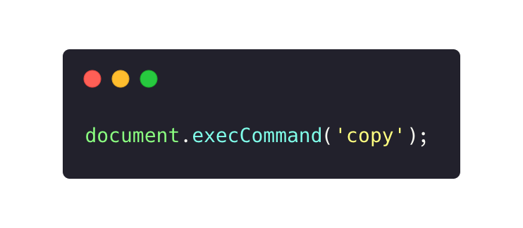
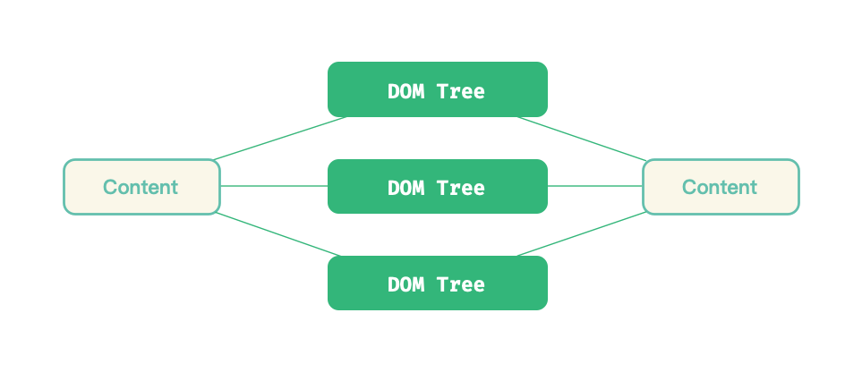
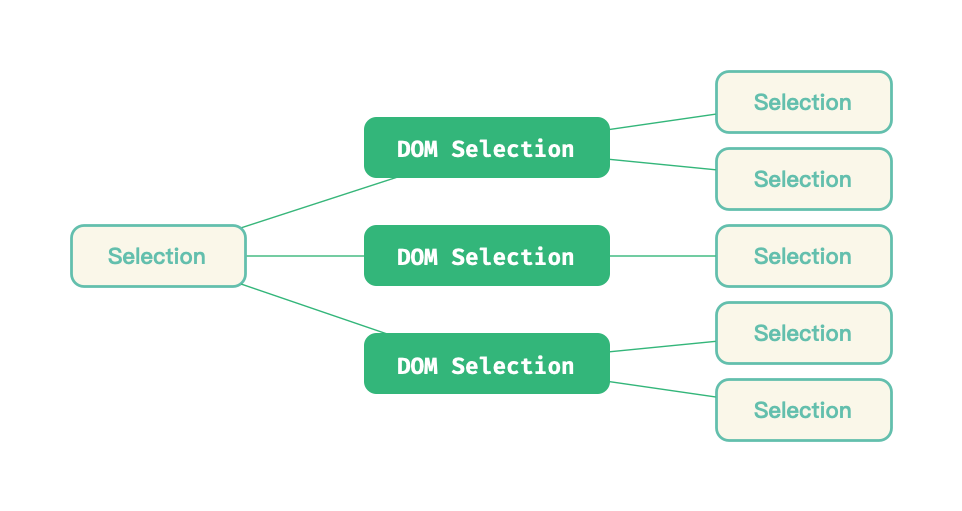
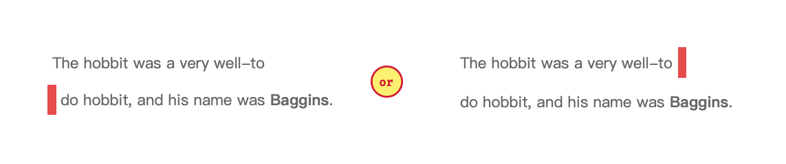
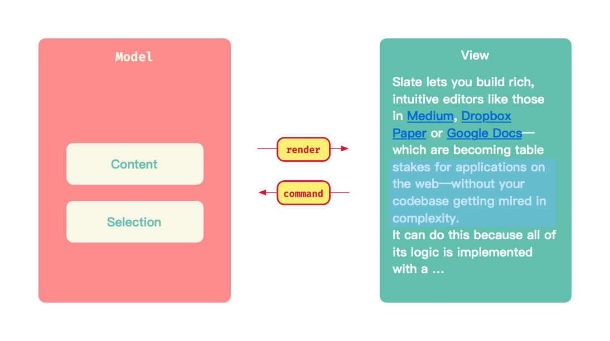

## Deep in Slate.js

<p align="center">
	
</p>


富文本编辑器，指的是用户能够在浏览器中编排富文本（具有风格及排版的文本，如可以设定字体样式，进行图文混排等）。通常，在英文社区，习惯称富文本编辑器为 「WYSIWYG Editor（what you see is what you get，所见即所得）」。

在富文本编辑器出现之前，浏览器已经具备了「展示」富文本的能力，开发者可以通过编排 HTML 和 CSS，实现对字号，字色等样式控制。但对于用户输入，所提供的 `<textarea />` 和 `<input />` 都只允许用户输入纯文本，能力十分单薄。

在 Web 浏览器中，实现对内容的「所见即所得」编辑，这里「所见（See）」，「所得（Get）」也就是指的 HTML 内容。我们在一个 WYSIWYG 编辑器中多选中的文本进行加粗，编辑器就要能就需要生成 `<b>xxx</b>` 或者 `<strong>xxx</strong>`的 HTML 内容，才能让用户看见变粗的文本。亦即，Web WYSIWYG 编辑器是让用户能够直接在浏览器中「编辑 HTML 内容」。

## contentEditable：让节点可编辑

早期的富文本编辑器实现中，例如当用户在编辑器中执行换行，编辑器拦截了这个用户事件后，就要创建一个新的段落（如生成一个 `<p />` 节点），这可能是通过 `document.createElement()` 或者类似 API 实现的。而微软的 Internet Explorer 在 5.5 版本（ 2000 年 7 月发布）中引入了 contentEditable 特性，直译为「内容可编辑」，这让 IE 浏览器中的 HTML 可以被编辑：当用户在一个 contenteditable 的节点中换行后，IE 就能自动为用户生成新的段落：

<p align="center">
	
</p>


contentEditable 涉及两个属性 `designMode` 与 `contentEditable`，前者可以控制整个文档（document）是否可以编辑，后者则是控制某个元素（element）是否可编辑。当时，微软发布的这个特性，除了一个[简要的使用文档](<https://docs.microsoft.com/en-us/previous-versions/windows/internet-explorer/ie-developer/platform-apis/ms537837(v=vs.85)?redirectedfrom=MSDN>)，没有对可编辑性的内在行为和实现做更多描述。

> 虽然是 IE 5.5 引入了 contentEditable，但对应的功能早在 IE 4 就可以通过自定义 ActiveX 控件实现。

行为及实现规范的缺乏，导致该特性只局限在了 IE 浏览器中使用。试想，当用户在可编辑内容中，敲入一个回车，这个时候，编辑器应当做什么？凡此种种，都需要一个规范来约束。为此，[WHATWG](https://www.wikiwand.com/en/WHATWG) 成员 Anne van Kesteren 在开始了对微软 contentEditable 特性的逆向工程之后，于 2005 年发表了一篇名为 [More on contenteditable](https://annevankesteren.nl/2005/07/more-contenteditable) 的博文，在其中举了一个例子：

```html
<!DOCTYPE html>
<div contenteditable>
  test
</div>
```

```html
<!DOCTYPE html>
<div contenteditable>
  <div>
    test
  </div>
</div>
```

当我们分别在这两个例子中敲入回车时，在 IE 5.5 中，前者将生成一个 `<p>` 元素，而后者生成的却是一个 `<div>`。

因此，为了推动 HTML 在浏览器中可编辑性的应用，WHATWG 小组开始着力于 contentEditable 的规范制定。同样是在 2005 年 7 月，Anne van Kesteren 撰写了[第一版 contentEditable 的规范](https://annevankesteren.nl/projects/whatwg/spec)。最终，经过标准委员会的不断努力，终于形成了 HTML 5 中的 [contentEditable 规范](https://html.spec.whatwg.org/multipage/interaction.html#contenteditable) 规范，这也是目前浏览器所遵循的规范。

在规范中，定义了两个角色：

- **editing host**：即正被编辑的 HTML 元素。如果某个 HTML 元素开启了 `contentEditable` 属性，那么这个元素就是一个 editing host；而如果 `document` 开启了 `designMode`，那么整个 HTML 文档下的元素都是 editing host。

- **editable**：即可编辑元素。若 HTML 元素是 editing host 的子孙，那么它就可以被编辑，另外，可编辑元素的子孙也是可编辑的（除非这些子孙被声明了 `contentEditable` 为 false）。

## `execCommand` ：使用命令进行编辑

通过 `contenteditable` 及 `designMode` 属性能让 HTML 内容能够被编辑，但是，它们仅仅是编辑能力的开关和入口，但如何根据用户行为动态设置 HTML 内容，IE 5.5 引入 contentEditable 特性时并没有考虑。直到 Firefox 3 问世，其不仅支持了 contentEditable，还配套了能够与可编辑元素进行互动的 API —— `document.execCommand`：即通过**发出指令（excute command）**编辑内容。

例如，我们想要完成当前选中文本的加粗就只需要执行：

<p align="center">
	
</p>


浏览器自己的 `document.execCommand` 并非无所不能，甚至还成为了文本编辑器的实现掣肘，不仅仅是支持的「指令有限」，就连同一个指令，各浏览器的「实现都有可能不同」。因此，更多的编辑功能仍然需要开发者进行事件劫持等操作才能实现。

## Why ContentEditable is Terrible

自从 contenteditable 被 IE 引入后，用户在浏览器的撰写文档时，拥有了更强大的能力，各大浏览器厂商也纷纷跟进，但是经过十多年的发展，各个浏览器仍然难以战胜特性背后的复杂性，带来统一的实现。

几年前，Medium Editor 的开发者之一 Nick Santos 发表过一篇著名的博文：[Why ContentEditable is Terrible?](https://medium.engineering/why-contenteditable-is-terrible-122d8a40e480)，当中罗列了 contenteditable 存在的一些问题。

### 视觉内容与实际内容的一对多关系

我们称用户看见的内容为「视觉内容」，称内容对应的 DOM 结构为 「实际内容」，在不同的浏览器中，用户在编辑器看到的同样的内容，可能被映射为了不同的 DOM 结构：

<p align="center">
	
</p>


下面这段文本：

> The hobbit was a very well-to-do hobbit, and his name was _**Baggins**_.

在不同的浏览器中，就可能形成不同的 DOM 内容：

```html
<strong><em>Baggins</em></strong>
<em><strong>Baggins</strong></em>
<em><strong>Bagg</strong><strong>ins</strong></em>
<em><strong>Bagg</strong></em><strong><em>ins</em></strong>
```

### 视觉选区与实际选区的多对多关系

选区的情况则更加糟糕，用户看到的选区，可能被映射为不同的 DOM 选区，而一个 DOM 选区，用户也会看到不同的视觉选区：

<p align="center">
	
</p>


例如，我们的 HTML 如果是：

```html
his name was <strong><em>Baggins</em></strong>
```

用户看到的光标落在 `Baggins` 前面，这样的选区，在内部可能分化为：

```html
his name was <cursor /><strong><em>Baggins</em></strong>
his name was <strong><cursor /><em>Baggins</em></strong>
his name was <strong><em><cursor />Baggins</em></strong>
```

在光标位置插入字符 `I`，DOM 选区的不同，最终导致了用户看到了不同的内容：

- his name was I_**Baggins**_
- his name was I_**Baggins**_
- his name was _**IBaggins**_

而假如我们的文本是：

> The hobbit was a very well-to-do hobbit, and his name was _**Baggins**_.

在 `well-to-` 后面换行，用户将看到：

> The hobbit was a very well-to
> do hobbit, and his name was _**Baggins**_.

对于 DOM 选区：「从第一行末尾到第二行开头的」，在视觉上看有两种可能：

- 光标要么落在第一行末尾
- 要么落在在第二行开头。

这就是「悬摆选区」，你无法告诉浏览器用户究竟期望看到什么视觉选区：

<p align="center">
	
</p>


## 主流的编辑器架构

由于 contenteditable 的不可靠，流行的 Web 富文本编辑器多采用下面的方案来规避 contenteditable 的缺陷：

- **模型与视图分离**：编辑器自定义视图无关的数据结构，视图的渲染不再由浏览器控制，而是由编辑器控制，从而满足视觉与实际内容的一一映射，避免在不同的浏览器中发散
- **自定义指令**：自定义编辑器的指令集，同样是避免直接调用 `document.execCommand` 在不同浏览器形成不一致的结果

<p align="center">
  
</p>


接下来，我们会以 [Slate.js](https://github.com/ianstormtaylor/slate) 为例，介绍目前主流的 Web 富文本编辑器架构方式。通过阅读这个小册，你将了解：

- Web 富文本编辑器的内核模型是怎么设计的，为什么要这样设计
- 编辑器的模型和视图之间是如何同步的
- 如何通过插件扩展编辑器
- 编辑器是怎么支持多人协同编辑的
- 一个完整的编辑器生态还应当包括什么
- 当前 Web 富文本编辑器面临的问题

> 这本小册基于的 Slate.js 0.44.x 版本，虽然 Slate.js 现在已经渐进到了 0.50.x 版本，但其架构编辑器的方式仍然是统一的，小册的初衷也在于借 Slate.js 分析和讨论 Web 富文本编辑器的架构方式，而不是教导怎么使用 Slate.js，因此版本的不同不会读者的知识消化产生影响。

## 关于作者

我目前是阿里钉钉文档协同团队的一枚弱鸡前端工程师，花名消珥（er），负责编辑器内核与插件的开发。相比较于我微不足道的博文创作，团队有更多厉害的大佬自研了编辑器内核，向上扩展了丰富的能力，实现了排版算法，在多人协作方面，还自研了协同引擎。

为了让编辑器工作地更好，我们也在探索并实践一些新兴领域，例如 WebAssembly。这个小册的创作离不开整个团队的智慧，如果你也对前端多人协作文档技术感兴趣，如果你厌倦了千篇一律的增删改查，想挑战前端富应用的尖端领域，不妨投递简历到我的邮箱：xiaoer.wxj@alibaba-inc.com 或者 18581867753@163.com，也可以直接加我微信二维码并注明 ”富文本编辑器“：

<p align="center">
  
</p>

和我之前创作的任何小册一样，我从不索取点赞和咖啡赞赏，博客创作只是我自我总结，验证的手段之一，我更期望读者能发现文章中的问题，或者提供实践中不一样的思路，并通过 Issue 反馈给我，那么你来杭州或者成都，我请你喝咖啡。

## 参考资料

- [The WHATWG Blog](https://blog.whatwg.org/the-road-to-html-5-contenteditable)
- [Why ContentEditable is Terrible?](https://medium.engineering/why-contenteditable-is-terrible-122d8a40e480)
- [Wiki - WYSIWYG](https://en.wikipedia.org/wiki/WYSIWYG#:~:text=In%20computing%2C%20What%20You%20See,web%20page%2C%20or%20slide%20presentation.)