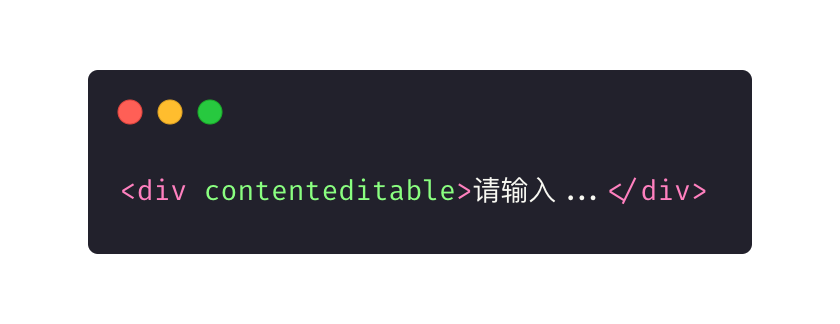

# Deep in Slate.js —— 深入 Slate.js

- 使用 Gitbook 阅读：[地址](https://app.gitbook.com/@wu-xiao-jun/s/deep-in-slate-js/)
- 使用 Github 阅读：[目录](./SUMMARY.md)

	

## 我需要一个富文本编辑器

富文本编辑器，指的是用户能够在浏览器中编排富文本（具有风格及排版的文本，如可以设定字体样式，进行图文混排等）。通常，在英文社区，习惯称富文本编辑器为 「WYSIWYG Editor（what you see is what you get，所见即所得编辑器）」。

当网站需要一个富文本编辑器时？你是否也会踟蹰在编辑器的选择？是选择百度出品的老牌编辑器 [UEditor](http://ueditor.baidu.com/website/)，它最熟悉国内用户，但是已经长期不更新了，还是选择最流行的 [CKEditor](https://ckeditor.com/)，如果愿意花钱，CKEditor 团队还能为你提供企业级的支持；如果你对商业化嗤之以鼻，更愿意拥抱开源社区，近几年，[Draft.js](https://draftjs.org/)，[Slate.js](https://www.slatejs.org/)，和 [ProseMirror](https://prosemirror.net/) 等新一代编辑器也纷至沓来。

但是如果有人告诉你「1 行代码」就能实现一个富文本编辑器，你会相信吗？即便你在一个非常古老的浏览器，不借助任何第三方库，也是可以做到的：

	

这个编辑器已经具备了基础的文本格式化（加粗、斜体），undo/redo 功能了，但是为什么没有任何成熟的商业网站会采用浏览器原生的富文本编辑能力呢？我们先稍微回顾一下 Web 富文本编辑器的历史。