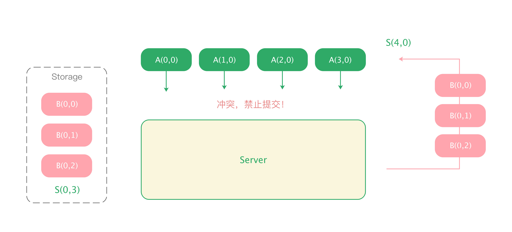
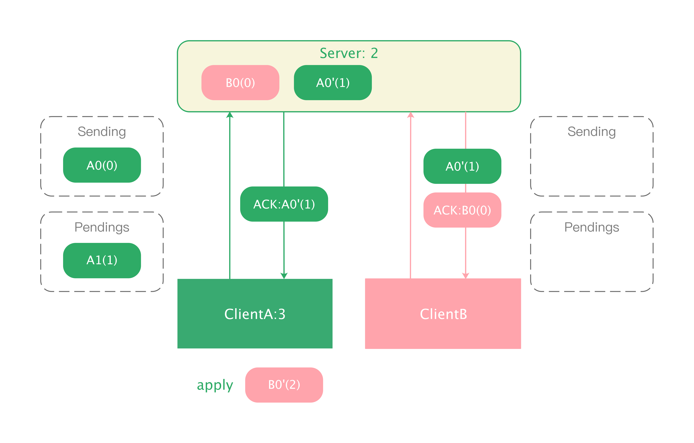
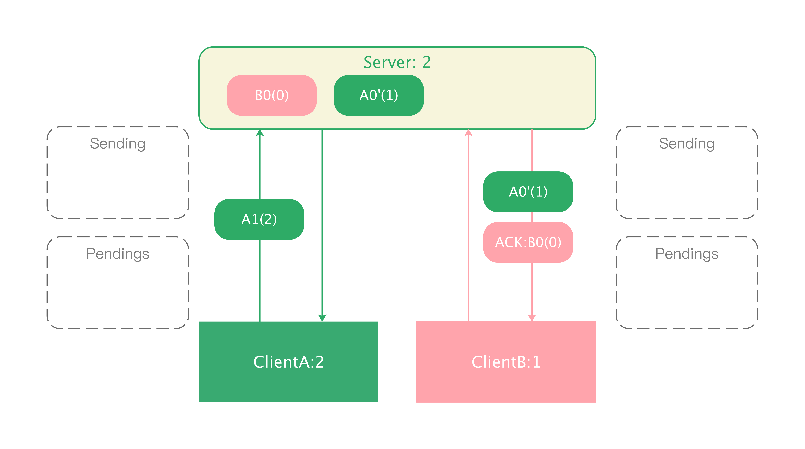

# 协同调度

## 新角色 - 服务端

前文展示的 A、B 用户同步操作的示例还较为简单，实际工程中，我们还需要服务端来收集、派发、存储各个客户端的 OP，被存储的 OP 代表了可连续应用的操作序列。

假定文档的初始状态为 S(0,0)。且：

* 服务端已经存储了 B 用户的三个操作，B(0,0)，B(0,1), B(0,2)，状态步进到了 S(0, 3)。
* A 用户也在 S(0,0) 状态下打开文档，执行了四个操作 A(0,0)，A(1,0), A(2,0), A(3,0)，状态到达了 S(4,0)

当 A 用户将本地操作提交到服务端时，服务端文档的状态是 S(0, 3)，A 用户的操作产生于 S(0,0)，无法直接应用，因此服务端不接收这些操作，但把 S(0,0) 后落库的操作 B(0,0), B(0, 1), B(0, 2) 几个操作给到 A，即告诉 A：“我给到你所有 S(0,0) 之后的变更，你调整好你的操作后，再来问我是否允许提交”：

  

A 获得服务端下发的 OP 后，进行 OT：

  

这个 OT 结果，因为 B(0,2) 应用后的上下文为 S(0,3) ， 等于 A(0,3) 的生成时的上下文，也意味着 OT 结果可以应用在 B 操作之后，那么 A 撤回本地操作之后，重新应用：

  

再次提交 A(0,3), A(1,3), A(2,3), A(3,3)，服务端的上下文状态 S(0,3) 等价于 A(0,3) 生成上下文，因此服务端也允许这些 OP 落库，那么服务端也能到达状态：

  

接着，服务端再将 A(0,3), A(1,3), A(2,3), A(3,3) 发送给客户端 B，B 应用操作后，则最终各个客户端与服务端看到了一致的状态 S(4,3)：

  

但是，如果在 A 做好了操作变换之后，再次尝试提交时，服务端又多了 B 的新的操作 B(0,4)，那么 A 新的操作因为上下文不匹配，再次被驳回。在一个多人协同密集的应用中，这样的架构设计显然是不可用的。

  

这个架构的优点是：

- 服务端只检测冲突，实现简单
- 保证了各端的操作顺序一致，一致性好

其缺点则较为致命：

- 打回几率高，操作滞留在本地，无法落库
- 客户端频繁被打回，频繁执行 OT，阻塞用户编辑

综上，该架构能支持的协同人数非常有限，是一个不可用的架构。

## 允许客户端提交，服务端处理冲突

我们看到，阻止客户端提交操作的架构，实际中基本不可用。那么自然会想到，如果服务端允许客户端提交，自己承担一些 OT 压力，又如何呢？还是回到上面的例子，现在服务端允许 A 提交它的操作，并且：

1. 在服务端执行 OT，将 OT 结果存储落库后，服务端的状态也步进到 S(4, 3)
2. 服务端在基于 A 的操作对 B 操作做变化，将 OT 之后的 B 操作发送给 A

  

而后，再将 [A(0,3),A(1,3),A(2,3),A(3,3)] 发给 B，最终各端的状态都将步进到 S(4,3)：

  

假如转换后的 B 操作给到 A 时，A 本地又新产生了 A(4,0) 和 A(5,0) ，使得本地状态步进到 S(6,0) 呢，此时 B(4,0), B(4,1), B(4,2) 无法作用到这个上下文：

  

那么在客户端，也会基于 [A(4,0), A(5,0)] 对 B 操作做变换，得到 [B(6,0), B(6,1), B(6,2)]，应用变换后的 B 操作，A 客户端的状态达到 S(6,3)。：

  

当 [A(4,0), A(5,0)] 也提交到服务端时，依据上述过程完成服务端 OT，得到 [A(4,3), A(5,3)]，最终各端的状态能达到相同的 S(6,3)：

  

新架构的特点是：

* 服务端收到 OP 时，服务端检测冲突，若无冲突，落库存储，存在冲突，进行服务端 OT，并将结果发送到前端。
* 前端收到 OP 时，若无冲突，则直接应用，反之，进行前端 OT 再应用收到的 OP。

上例中，我们可以看到，客户端和服务端执行了不同的 OP 序列

  

因此，这个架构依赖于 OT 算法能使下述等式成立：

> S ○ opsB ○ OT(opsA, opsB) = S ○ opsA ○ OT(opsB, opsA)

该架构的优点显而易见，客户端的操作不会被打回，但回到例子中，如果 A 用户还没收到服务端下发的 B 操作时，又继续提交了 [A(4,0), A(5,0)] 呢。服务端下发或者即将下发的 B 操作将没有意义，下发到 A 后，他们无法被作用，也无法 OT 后被作用——服务端不得不再使用新提交的 OP 重新做 OT。

如果客户端源源不断的地提交 OP，服务端将疲于应付，客户端也不能及时收到他人的更新。并且，如果有 N 个客户端，那么服务端需要维护一个 N 维状态向量，OT 过程的复杂度可就不只是上文我们看到的二维的棋盘变换了。

综上，这个架构也难于付诸实际。

## 限制客户端提交频度，让你提交才能提交

那么我们自然想到，应该限制客户端提交 OP 的频度。假定客户端每次只能提交一批 OP（为了简单，这里我们限制客户端每次只能向客户端提交 1 个 OP），只有当服务端处理完毕，并告知客户端后，才能继续提交下一批 OP。

我们也不再使用 N 维向量作为上下文的表示，而使用一个单调自增的版本号，假定初始版本为 0。每次变更都会让版本号+1，客户端提交 OP 时，捎带版本号（生成上下文），以便检测冲突，例如 A(0) 就表示了 0 版本下生成的操作 A。

假定 A、B 两个客户端发生了如下变更：

- 客户端 A 本地产生了三个操作 A0(0), A1(1)
- 客户端 B 本地产生了一个操作 B0(0)

  

首先，B0(0) 被提交到服务端，由于数据库中 OP 序列为空，因此 B0(0) 可以直接落库，服务端将版本更新为 1。并将 B0(0) 发给其他客户端，然后服务端会发送 ACK（Acknowledgement Character）到 B，告诉 B：“你的 OP 服务端已经收到”：

  

在客户端 A，提交了 A0(0)，服务端检测到冲突，执行 OT，将获得的 A0'(1) 落库，更新服务端版本为 2，并将 A0'(1) 分发到其他客户端。

  

在客户端 A，也收到了服务端派发的 B0(0)，A 检测到冲突，基于 [A(0), A(1)] 对 B0(0) 做变换，得到 B0'(2)，更新本地版本为 3。

  

紧接着  A 受到了 A0'(1) 的 ACK，更新本地版本为 2，现在继续提交 A1(2)（因为客户端版本已更新为 2，所以此时提交的操作捎带的客户端版本为 2）：

  

同理，B 客户端受到 ACK 以后也更新自己的版本为 1，紧接着到来的 A0'(1) 也可直接应用，更新版本到2。由于服务端当前版本也是 2，因此 A1(2) 可以直接落库，服务端更新版本为 3。服务端广播 A1(2) 到其它客户端：

  

B 再收到 A1(2) 之后，能够直接应用，应用后，更新状态为 3。最终各个客户端和服务端到达了一直的版本 3：

  

这个架构中，基于 ACK 机制，不但限制了 OP 提交的频度，也方便地通过简单地版本号就表示了文档上下文，避免维护一个 N 维状态向量。它已经是一个非常接近实际工程的基于 OT 的协同调度过程了。但本文的描述也只是实际工程的冰山一角，协同过程还面临着：

* 如何实现支持多人协同的 undo/redo？
* 如何处理离线场景？
* 如何保证客户端/服务端 OT 算法的统一？
* 如何治理复杂的网罗环境？
* 如何保证多人协同下的编辑器性能？
* ...

本文无意直接讲述一个生产环境协同引擎内部的繁文缛节，而是通过三个渐进的 OT 调度方式，帮助读者认识到多人协同面临的困难，又该如何各个击破这些困难，因为从没有一开始就完美的架构，和读者一起过渡，一起思考，一起叹息，一起做的更好，最后再各自的系统和领域上深入，才是本系列追求的行文路径。

## 参考资料
* [Visualization of OT with a central server](http://operational-transformation.github.io/)
* [Google Wave OT](https://svn.apache.org/repos/asf/incubator/wave/whitepapers/operational-transform/operational-transform.html)
