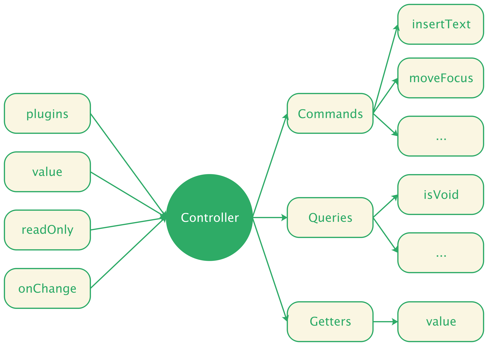

# Controller

Controller 是 Slate.js 大脑，这里我们使用了早期 Slate.js 版本的命名 Controller 而不是现在的 Editor，前者更恰当的表述了它集合了 Slate.js 所有的控制逻辑。

<p align="center">
  
</p>

开发者可以通过实例化一个 Controller 对象，实现对文档内容的访问和控制：

```js
import { Editor } from 'slate'

const controller = new Editor({
  value,
  plugins,
  readOnly,
  onChange
}, { normalize: false });
```

可以看到，初始化一个编辑器，需要告诉 Slate.js:

- `value`：编辑器的初始值
- `plugins`：编辑器具有哪些能力，即为编辑器注册哪些插件，我们会在 [插件](./plugin) 一节中对其做更详尽的描述
- `readOnly`：编辑器是否为只读模式
- `onChange`：当文档模型变更后，应当作何反应。对于视图来说，可能就是刷新页面，对于数据传输来说，可能就是持久化这些变更

另外也支持对初始化过程做一些配置，例如：

- `normalize`：是否对文档进行 normalize，这个概念我们将在 [normalize](./normalize) 一节中阐述

Controller 是 UI 无关的，其绑定的方法都是用来操作文档模型（内容及选区）的：

```js
controller
  .insertText('Hello World')
  .moveToStartOfNextText()
```

这些方法在 Slate.js 被命名为 Command，即指令，接下来我们就看看 Slate.js 是如何设计指令系统的。


