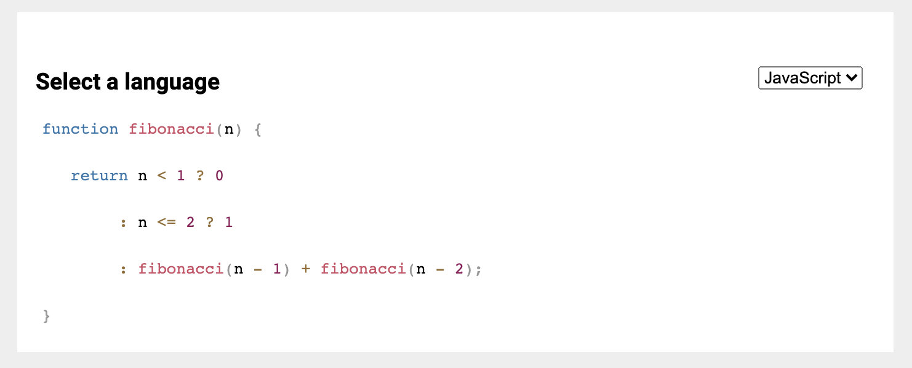
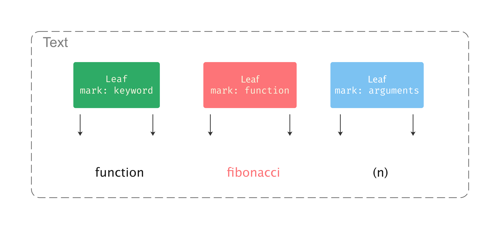

# Decoration

如果我们要为编辑器增加 “查找/替换” 或者 “代码高亮” 的功能，它们共同的特点都是：

* 消费但不改变文档内容
* 从文档内容中计算得到视图层需要的内容

<p align="center">
  
</p>

Slate.js 为此设计了 Decoration 应付此类需求。顾名思义，Decoration 表示了内容装饰，一个 Decoration 对象含有属性：

- `start`/`end`：Decoration 装饰的一个区间内的所有节点
- `mark`：Decoration 使用了 Mark 来表示装饰类型

<p align="center">
  
</p>

插件通过实现 `decorateNode` hook 来告诉 Slate.js：视图层需要的数据如何从当前的节点计算得到。当编辑器开始渲染文本时，会根据生成的装饰序列，构建「不同的 Leaf 节点」，在 `renderMark` hook 中，可以通过 decoration mark 类型的不同，执行不同方式的渲染。下例中，就通过 Decoration 实现了「链接高亮」：

```js
const LinkPlugin = () => ({
  decorateNode: (node, controller, next) => {
    if (Text.isText(node) && isUrl(node.text)) {
      return [Decoration.fromJSON({
        start: { key: node.key, offset: 0},
        end: { key: node.key, offset: node.text.length },
        mark: { type: 'link' }
      })]
    }
    return []
  },
  renderMark: (props, controller, next) => {
    const { mark, ...rest } = props;
    if (mark.type === 'link' ) {
      return <Link { ...rest } />
    }
    return next();
  }
})
```

`decroateNode` 的实现的是「响应式的」，即由节点内容计算得到装饰内容。但有时候，decorations 却不是根据节点生成的，而是由业务逻辑生成的。例如，当我们输入 `@` 符号后，期望展示 mention 列表，我们就可以在对应指令中，手动调用 `controller.setDecorations(decorations)` 来为 @ 包裹一个 decoration，当渲染到这个 decoration 时，UI 上呼出 mention 列表：

```js
const MentionPlugin = () => ({
  commands: {
    insertMention: (controller) => {
      const { value } = controller;

      controller.command(Commands.insertText, '@');
      const decorations: Decoration[] = value.decorations.filter(
        (item) => item.mark.type !== 'mention',
      );
      
      // ...

      decorations.push(
        Decoration.fromJSON({
          start,
          end,
          mark: {
            type: 'mention',
            klass: 'mark',
          },
        }),
      );

      return controller.setDecorations(decorations);
    }
  }
})
```

>  使用 `controller.setDecorations(decoratins)` 设置的 decorations 是 top-level 级别的，被保存在了 `controller.value` 上。

## 注入与分发

从上面的例子可以知道，一个节点被装饰的序列就来源于：

- **注入的 decorations**：例如父节点注入的 decorations
- **自己的 decorations**：由 `decorateNode` 生成

诸如代码高亮这样的场景将会生成非常多的 decorations，每个词法分析阶段获得的 token 都是一个 decoration。渲染文本时，从全量的 decorations 获得文本的装饰序列就是非常耗时的。为此，Slate.js 期望「在节点渲染时，它只拿到自己被装饰的 decorations」，因此，渲染节点树时，Slate.js 会进行 decorations 的分发，这个过程具体是：

1. 首先为根节点（document）注入 top-level 的 decorations（`controller.value.decorations`）
2. 渲染 Node 期间，每个节点会先合并「当前节点被注入的 decorations 」和「节点 `decorateNode` 生成的 decorations」，再将合并后的 decorations 分发到子孙节点
3. 直到 decorations 被分发到了文本节点（text node），会根据 decorations 拆分出不同的 Leaf
4. 渲染 Leaf 期间，插件的 `renderMark` 被调用，插件按照 mark 类型的不同进行不同的渲染

```js
// packages/slate-react/src/components/node.js
class Node extends React.Component {
  render() {
    const { decorations} = this.props
    // 当前节点被装饰到的 decorations = `decorateNode`（自己的） + `props.decorations`（注入的）
    const decs = decorations.concat(node.getDecorations(editor))
    // 拆分出各个孩子节点被装饰到的 decorations
    const childrenDecorations = getChildrenDecorations(node, decs)
    const children = []

    node.nodes.forEach((child, i) => {
      const isChildSelected = !!indexes && indexes.start <= i && i < indexes.end

      children.push(
        this.renderNode(child, isChildSelected, childrenDecorations[i])
      )
    })

    // ...

    const element = editor.run('renderNode', {
      ...props,
      attributes,
      children,
    })

    return editor.query('isVoid', node) ? (
      <Void {...this.props}>{element}</Void>
    ) : (
      element
    )
  }
}
```

<p align="center">
  
</p>


Decoration 的工作机制有下面这些特点：

- **渲染期计算**：decoration 是在渲染期间被计算出的
- **自顶向下分发 decorations**：避免节点遍历超长 decorations 序列
- **限制计算**：由于 Node Component 做了 re-render 频度控制，当编辑器模型变更时，不需要 re-render 的 Node 也不会被计算 decorations。例如我们在处理链接高亮的时候，如果链接节点没有变化，它的 decorations 不会被重新计算。

## 参考资料

- [Speed up decorations rendering](https://github.com/ianstormtaylor/slate/pull/1801)

