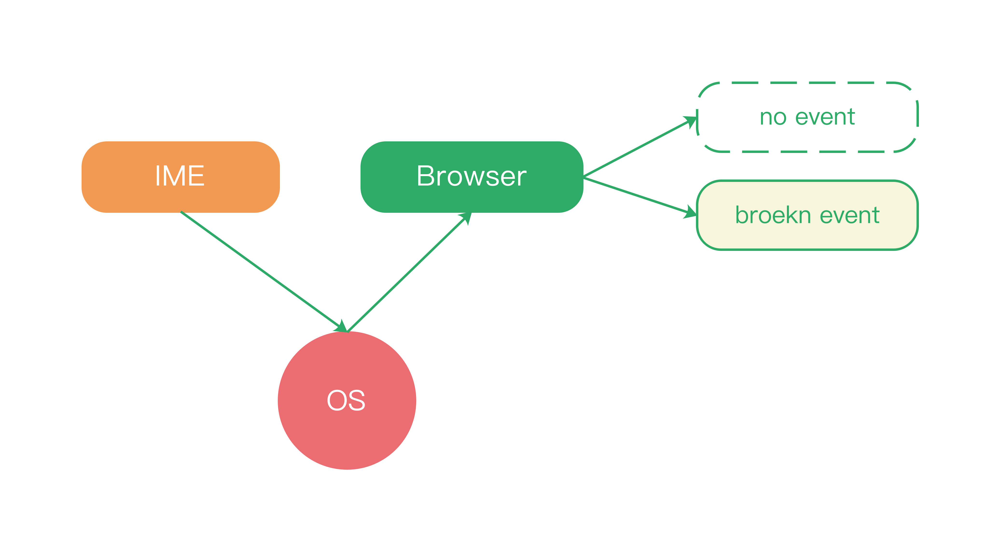
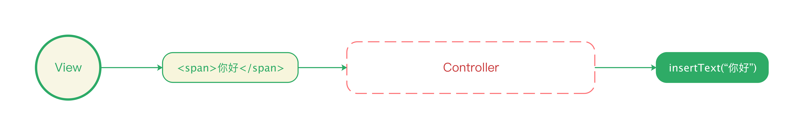
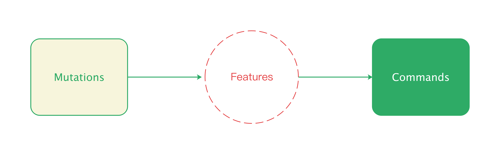
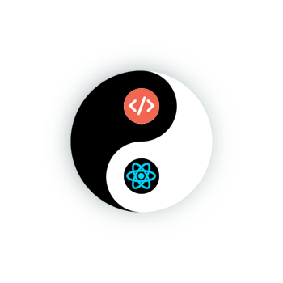
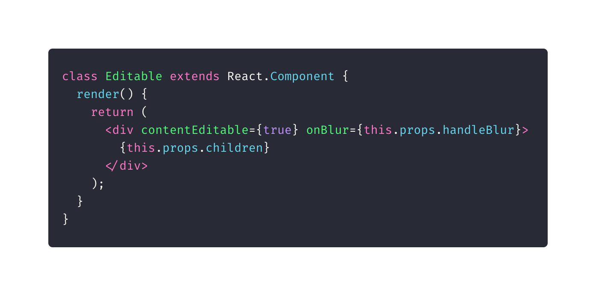

# 跌入泥潭 - 输入法噩梦

前文中，我们认为 Slate.js 定义了一套接近完美的 MVC 架构，简单，清晰，易于扩展。但实践过程的真的是如此吗？

从 Slate.js 一直还停留在 0.x 版本，一直 breaking change 不断，也不难窥见其尚未稳定。那么阻碍 Slate.js 架构稳定应用的原因是什么呢？首先我们得知道，Slate.js 定义的架构要能完美工作，离不开两个重要条件：

1. **能正确理解用户意图**：Slate.js 能够正确且详实的 UI Event，推导用户行为
2. **对视图有绝对控制权**：视图的所有表现都来源于 Slate.js 供给的数据

但这两个条件都并不只决定于 Slate.js，一方面，UI Event 由浏览器供给，意图的推测离不开浏览器。另一方面，视图的更新既被浏览器对 contenteditable 的实现控制，又被 React 控制。因而，实践中的编辑器数据环路会是：

<div style="text-align: center">
  
</div>

我们不妨以 Slate.js 开发者最大的噩梦 — 输入法（IME）为例，来了解 Slate.js 在追求架构完美却又受制于环境现实的矛盾和挣扎。

> 笔者曾经用一篇专题博客叙述了输入法噩梦，感兴趣的读者可以阅读：[从流行的编辑器架构聊聊富文本编辑器的困境](http://yoyoyohamapi.me/2020/03/01/%E4%BB%8E%E6%B5%81%E8%A1%8C%E7%9A%84%E7%BC%96%E8%BE%91%E5%99%A8%E6%9E%B6%E6%9E%84%E8%81%8A%E8%81%8A%E5%AF%8C%E6%96%87%E6%9C%AC%E7%BC%96%E8%BE%91%E5%99%A8%E7%9A%84%E5%9B%B0%E5%A2%83/)。


## 输入法噩梦

### 噩梦来由：脆弱的事件

除了操作系统的自带的输入法，大部分用户更习惯安装和使用第三方厂商的输入法，例如搜狗输入法，百度输入法等。不同厂商的输入法实现，只是在完成输入源（键鼠，手写板等）和操作系统之间的互动，例如我们需要为 Android 开发一款输入法，我们只关心 Android OS 提供的[接口和协议](https://developer.android.com/guide/topics/text/creating-input-method)。输入法并不直接和浏览器打交道，浏览器也需要通过操作系统去获得输入法状态，再把输入法过程翻译为标准所定义的事件流，例如 `compositionstart` event 、`beforeinput` event 等。

<div style="text-align: center">
  
</div>

<div style="text-align: center">
  
</div>

实际中，浏览器尝试转译输入法过程时，却会出现：

* **无法交付事件**：当输入进行时，浏览器可能无法交付 `beforeinput` 事件，Slate.js 就无法获悉用户意图
* **无法完整交付事件信息**：部分 Android 输入法实现时，无论用户继续按下哪种按键， `keyCode` 始终是 229，也会导致 Slate.js 无法获悉意图

> W3C KeyCode 规范 定义了 keyCode 为 229 的 Keyboard Event 是表示输入法正在处理按键输入

事件或者事件信息的缺失，导致 Slate.js 数据环路的第一步就中断了：到底用户做了什么操作，我该怎样更新模型？

<div style="text-align: center">
  
</div>

举个例子，我们插入了一个图片后，期望通过退格键删除图片，但在某个厂商的输入法下退格，回调的 `keyCode` 却一直是 229，编辑器无法知道用户到底在做什么，也就无法通过对应的指令去执行删除操作，最终，用户怎么也删不了图片。

时至今日，Slate.js 仍然对 Android 深感无力：

> On mobile, iOS devices are supported but not regularly tested. Chrome on Android was until recently unsupported except for in older versions of Slate (0.47) but has recently been added. For clarity, due to the differences in Android's support of the beforeInput event, Android input uses compositions and mutations which is different from other browsers. This means that Android support progresses separately from other browsers and due to it being new, may have more bugs.

另一款流行的 React 富文本编辑器 Draft.js 同样如此：

<div style="text-align: center">
  
</div>


### 亡羊补牢：由现象推导意图

事件的脆弱，让 Slate.js 无法根据事件推导用户意图。但我们也发现，如果我们先放开事件对于事件的拦截，将输入过程完全托管给 contenteditable 元素（无论是 `<textarea />` 还是 `<div contenteditable="true" />`），那么输入结果是符合预期的。

因此 Slate.js 在处理 Android 输入法问题的策略是：放弃「基于事件的同步」策略，改为「基于现象的同步」策略。

> 这个能力被封装在 slate android plugin 中，设计动机可以查看这个 issue：[Input is wonky on Android devices](https://github.com/ianstormtaylor/slate/issues/725)


这很类似于 [Prosemirror](https://prosemirror.net/) 等框架，由视图的变更去推导用户意图，进而更新数据模型，是一种视图先于数据的策略。

现在，当用户输入 “你好” 之后，Slate.js 不再是通过事件知晓用户输入了 “你好”，而是通过观察 DOM 的变化得知。

<div style="text-align: center;">
  
</div>

Web API 提供了 [MutationObserver](https://developer.mozilla.org/en-US/docs/Web/API/MutationObserver) 来监听 DOM 变更。当通过 MutationObserver 开始监听 DOM 后，每当这个 DOM 发生变化（无论是内容还是结构），都会回调给我们变更序列，变更序列的每个对象都是一个 [MutationRecord](https://developer.mozilla.org/en-US/docs/Web/API/MutationRecord) 对象。

```ts
// Select the node that will be observed for mutations
const targetNode = document.getElementById('some-id');

// Options for the observer (which mutations to observe)
const config = { attributes: true, childList: true, subtree: true };

// Callback function to execute when mutations are observed
const callback = function(mutationsList, observer) {
    for(const mutation of mutationsList) {
        if (mutation.type === 'childList') {
            console.log('A child node has been added or removed.');
        }
        else if (mutation.type === 'attributes') {
            console.log('The ' + mutation.attributeName + ' attribute was modified.');
        }
    }
};

// Create an observer instance linked to the callback function
const observer = new MutationObserver(callback);

// Start observing the target node for configured mutations
observer.observe(targetNode, config);

// Later, you can stop observing
observer.disconnect();
```

`MutationRecord` 中携带的信息就能让我们知道 DOM 究竟发生了怎样的变化，进而推测出用户意图，例如在某些 Android 设备下，用户按下退格后，将观察到这样的特征：

1. `mutations.length > 1`
2. `mutations[0].type === 'childList'`
3. `mutations[0].removeNodes.length > 0`

那么，编辑器就定义：若 DOM 变更具备这样的特征，则用户意图为删除，进而调用删除指令去更新数据模型，以此解除了对于事件的依赖。

<div style="text-align">
  
</div>

这可以看做是 “人工学习”，特征都来源于人肉测试，而无法自己训练去丰富特征。并且由于输入法的繁复，测试阶段也是无法穷举出所有用户行为对应的特征的，往往特征的丰富还来自于用户问题的反馈，每个问题背后对应的机型和输入法，又能得出一系列特征。

<div style="text-align: center">
  
</div>


### 牢也不牢：DOM 的虚实调和

似乎「基于现象的同步」弥补了「基于事件同步」 在事件不可靠时的无力。但这个算法却放开了视图的控制权，原本被 React 控制的视图更新，现在也会被浏览器对于 contenteditable 的处理错控制。

由于 React 是基于虚拟 DOM 治理视图的，我们不妨称之为 “虚”，而浏览器处理的则是真实 DOM，我们不妨称之为 “实”。

<div style="text-align: center">
  
</div>

一旦 React 和浏览器在 DOM 上出现分歧，就会导致系统崩溃，所以当我们在 React 组件中使用 contenteditable：

<div style="text-align: center">
  
</div>

React 也 “贴心地” 向你提示了 “后果自负”：

> Warning: A component is contentEditable and contains children managed by React. It is now your responsibility to guarantee that none of those nodes are unexpectedly modified or duplicated. This is probably not intentional.


则「基于现象的同步」，将面临 DOM “虚实调和” 的问题，新的牢笼亦不稳固。当我们放弃拦截事件，转而让 contenteditable  DOM 先刷新，DOM 就会越过 React 去刷新，而当 React 发现自己维护的 VDOM 无法再和真实 DOM 对应的时候，就会虚实不调，阴阳失衡，大概你在看到这样的错误后，整个编辑器崩溃：

> DOMException: Failed to execute ‘removeChild’ on ‘Node’: The node to be removed is not a child of this node.


因此，在一些容易产生虚实不调的场景（例如段落分裂和合并），或者我们在 `componentDidCatch` 这样的 hook 中捕获到类似的错误，就需要「强制重刷（rerender）」组件，以保证虚实调和。但是对于一篇中大型文档，重绘的代价也是十分高昂的。现在，用户虽不再抱怨无法输入或者无法删除了，但又会对频繁的卡顿而叫苦不迭了。因此，Slate.js 仅仅在 Android 这样的场景使用了「基于现象的同步」，其他场景还是依赖于事件去同步模型和视图。


## 架构优美 or 可靠稳定？

Slate.js 确实定义了一套简约、清晰的架构，收益于此的更多的是开发者，他们能更容易的开发编辑器插件，扩展编辑器能力。但当这套优美的架构置身在 Web 浏览器泥潭，要保障用户体验，需要去做好的确实繁多的细节。

富文本编辑器在褪去光鲜亮丽的架构外衣之后，依然有一个愿意去做脏活儿累活儿的躯干，我想也是评价富文本编辑器好坏的标准之一。


## 参考资料

* [MDN - MutationObserver](https://developer.mozilla.org/en-US/docs/Web/API/MutationObserver)

* [从流行的编辑器架构聊聊富文本编辑器的困境](http://yoyoyohamapi.me/2020/03/01/%E4%BB%8E%E6%B5%81%E8%A1%8C%E7%9A%84%E7%BC%96%E8%BE%91%E5%99%A8%E6%9E%B6%E6%9E%84%E8%81%8A%E8%81%8A%E5%AF%8C%E6%96%87%E6%9C%AC%E7%BC%96%E8%BE%91%E5%99%A8%E7%9A%84%E5%9B%B0%E5%A2%83/)