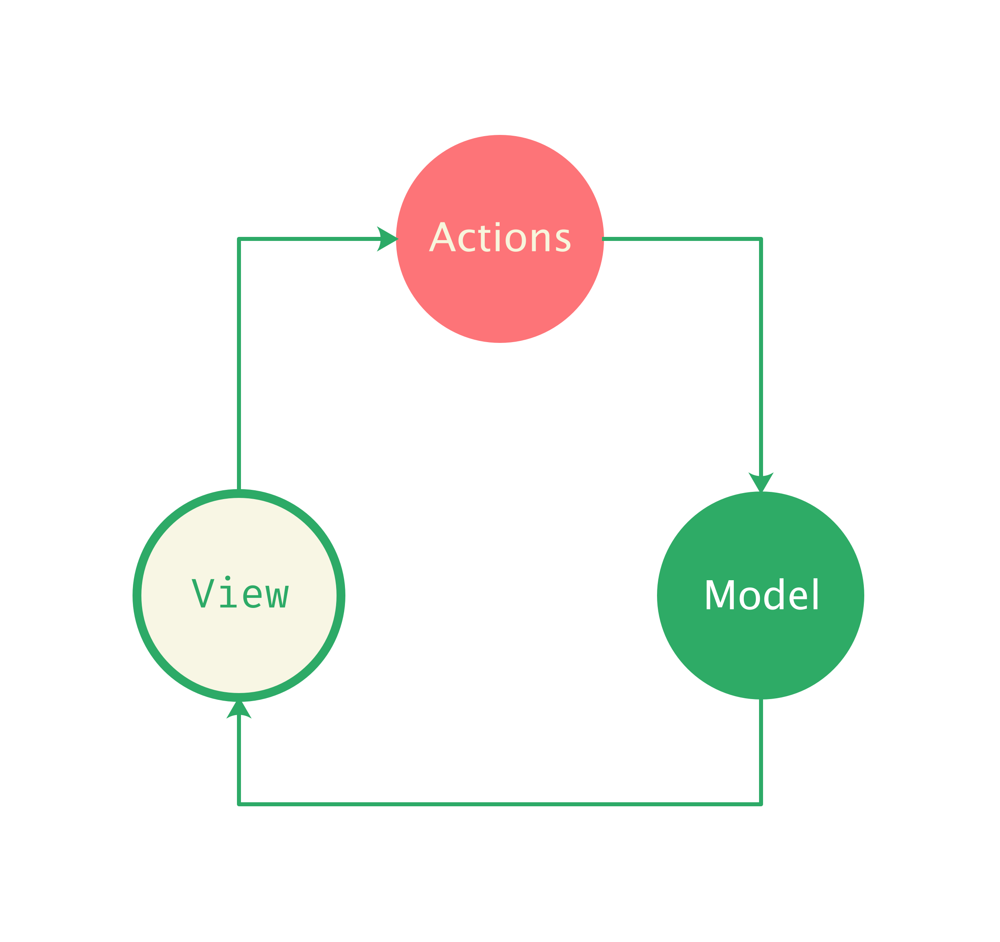

# Slate.js 是怎么工作的

我们回顾在 [Slate.js 介绍](./introduce-slate.md) 中展示的一个集成了文本加粗概念的编辑器 Demo：

<p align="center">
	
</p>

Slate.js 本身提供了一个视图无关的内核，但在这里，因为我们选择了 React 作为视图层框架，因此引入了 `slate-react` 来连接 React 与 Slate.js。

当用户在富文本编辑器中，选中了一段文本，并按下加粗快捷键，最终看到这段选中的文本被加粗，其中经历了：

- 应用程序声明了一个加粗「插件（Plugin）」，并通过 slate-react 提供的 `<Editor />` 组件向 Slate.js 注册了这个插件

  ```jsx
  const plugins = [BoldPlugin()];
  
  <Editor
    plugins={plugins}
  />
  ```

- 用户的按键事件被插件拦截，触发了插件 `onKeyDown` 回调，在当中，通过编辑器实例调用「指令（Command）」去为文本设置了类型为 `bold` 的 mark

  ```js
  const BoldPlugin = () => {
    onKeyDown: (event, controller, next) => {
      if (isBoldHotKey(event)) {
        return controller.toggleMark('bold')
      }
      return next();
    }
  }
  ```

- 指令执行过程中，将产生一个个的「操作（Operation）」序列
- 操作被逐个「应用到（apply）」当前编辑器模型，根据操作类型的不同，模型进行不同的修改，受影响的节点路径被标识为「脏路径（dirty path）」
- 命令执行完毕，Slate.js 通过通过脏路径知道了哪些节点受到命令的影响，受影响的节点会被按照预设的规则进行「normalize」，例如合并相邻文本等等

- 等到下一个渲染周期，Slate.js 会将最新的模型告知视图层，视图层通过在插件中声明的 `renderMark` 回调渲染了用户最终所见到的加粗后的文本

<p align="center">
	
</p>

我们如果把中间过程中都概括为 Actions，那么这就是经典的「单项数据流」链路：

<p align="cenert">
  
</p>

接下来的章节，循着这个 Demo，会逐一介绍 Demo 中涉及的概念以及这些概念背后的实现。首先我们先认识一下 Slate.js 的大脑：Controller。