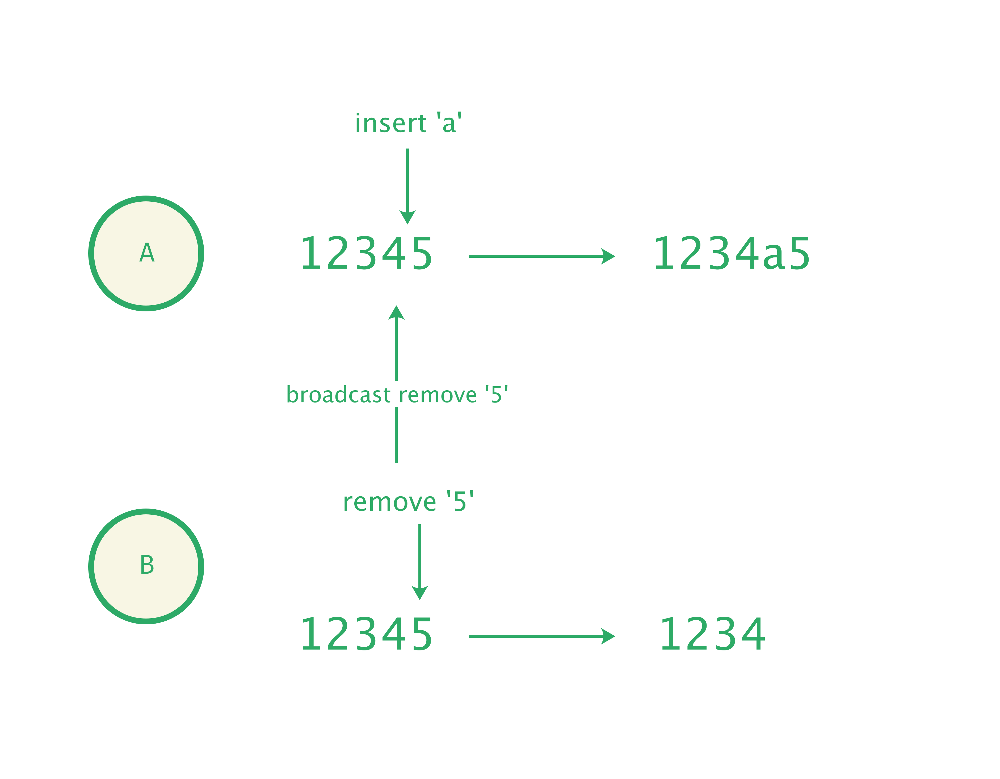

# Slate.js 是如何支持协同的？

在 [「Slate.js 是怎样工作的 - Operation」](./operation.md) 一节中，我们知道 Slate.js 使用了差量变更（Operation）来描述对文档的修改，使得不同操作者的对文档的修改，都能以较小的粒度在网络中互通并应用。

<p align="center">
  
</p>

假定文档的初始内容为：

```tsx
<text>Hello</text>
```


有两个协作用户 A、B 打开了这篇文档，并开始编辑：

* A 在 "Hello" 后插入了 "World"
* B 对 "Hello" 进行了加粗

那么将生成两个对文档的操作：

```js
{ type: 'insert_text', path: [0], offset: 5, text: 'World', marks: [] } // A's op
{ type: 'add_mark', path: [0], offset: 0, length: 5, mark: ['bold'] } // B's op
```


将 Operation 序列传给编辑器，通过 `applyOperation(op)` API，就能合成新的文档内容：

```ts
const newDoc = operations.reduce((val, op) => {
  const {value} = editor.applyOperation(op);
  return value;
}, editor.value);
```


这个场景中，A 应用了 B 的操作后，B 应用了 A 的操作后，最终看到的内容都会是：

```tsx
<text><strong>Hello</strong>World</text>
```

<div style="text-align: center">
  
</div>

可以看到，基于 Operation，非常容易的就能合并多个协作的操作到同一篇文档，所以 Slate.js 敢说自己是现代化的，原生支持协同的编辑器。

但如果 A、B 的操作分别是：

* A 在 "Hello" 后插入了 "World"
* B 在 "Hello" 前插入了 "!"

那么将生成两个对文档的操作：

```js
{ type: 'insert_text', path: [0], offset: 5, text: 'World', marks: [] } // A's op
{ type: 'insert_text', path: [0], offset: 0, text: 'Say:', marks: [] } // B's op
```


A 执行了 B 的操作后，文档更新为了：

```tsx
<text>Say:HelloWorld</text>
```

B 执行了 A 的操作后，文档更新为了：

```tsx
<text>Say:HWorldello</text>
```

<div style="text-align: center">
  
</div>

糟糕，现在 A、B 看到的内容不一样了，我们开始怀疑 Slate.js 对协同的支持了。其实，Slate.js 的表述没错，它提供了实现一个协同编辑器需要的能力（差量变更），但是它没有提供所有协同编辑器需要的能力。接下来，我们就看看，要实现一个可协同的编辑器，还需要做哪些工作？