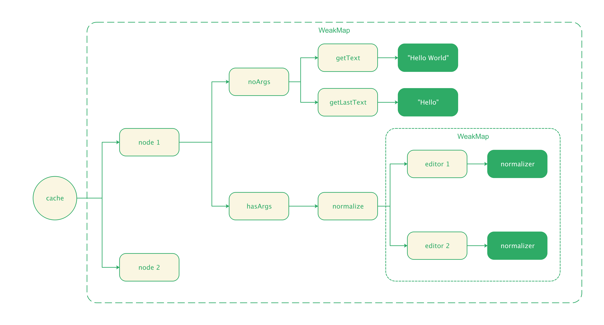
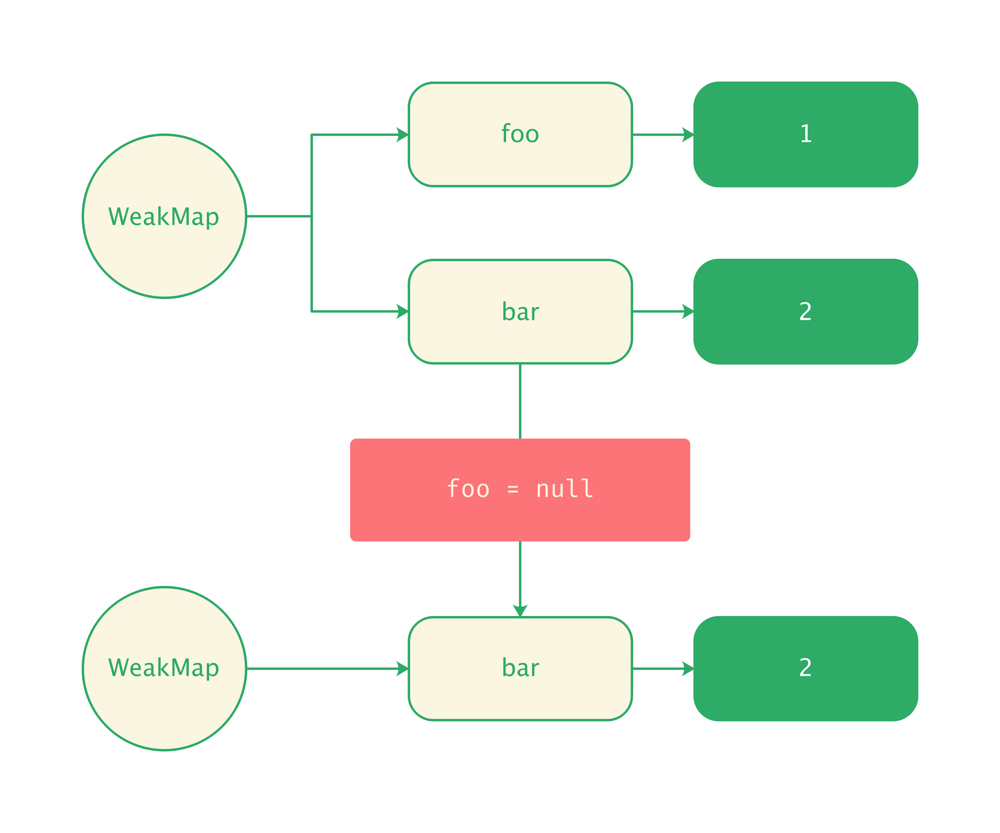

# Memorize

在 Slate.js 中，存在一些高频调用的操作，例如，在 [path]() 一节中提到的 `node.getKeysToPathsTable()`，它会构建当前节点及其所有子孙的 key-to-path table。

假设我们的文档很大时，每次查询节点路径都调用 `node.getKeysToPathsTable()` 重新构建 key-to-paths table，就会造成严重的性能问题。

为此，Slate.js 通过 memorize 技术为函数调用做了缓存，这是一种常规的性能优化手段：将函数的执行结果缓存，下一次以同样的「参数」和「上下文」调用函数时，直接返回缓存的结果。

```js
memoize(NodeInterface.prototype, [
  'getFirstText',
  'getKeysToPathsTable',
  'getLastText',
  'getText',
  'normalize',
  'validate',
])
```

Slate.js 通过 [WeakMap]() 创建了对象的函数缓存，每个对象的缓存包含了「有参数调用」和「无参数调用」函数两个 hash map。特别地，对于有参数调用，memoize 需要考虑为不同的参数集合设置不一样的缓存，并且，所有以对象为参数的缓存，都用 WeakMap 构建。



我们用一个简单地例子来理解 Slate.js memoize 的结构：

```js
class Num {
  constructor(num) {
    this.num = num;
  }
  
  add(rhs, n) {
    return this.num + rhs.num + n;
  }
}
memoize(Num, ['add']);
const left = new Num(1);
const rhs1 = new Num(1);
const rhs2 = new Num(2);
left.add(rhs1, 1);
left.add(rhs1, 0);
left.add(rhs2, 0);
```

上面这个例子， `momoize` 最终为 `left` 对象生成的有参数缓存就会是：

```js
{
  hasArgs: {
    add: {
      STORE_KEY: WeakMap({
        [rhs1]: {
          1: 3,
          0: 2
        }
        [rhs1]: {
        	0: 3
      	}
      })
    }
  }
}
```

当下一次调用 `left.add(rhs, 1)` 后，我们就能沿着缓存路径，获得缓存的计算结果 `3`。

## Why WeakMap?

在 JavaScript 应用程序开发中，我们惯常使用一个普通的 plain object 作为缓存，包括在 Slate.js 早期版本中，也是使用的 plain object 作为 memoize 缓存：

```js
let foo = { name: 'foo' }
let bar = { name: 'bar' }
const cache = {
  foo: foo,
  bar: bar,
  // ...
}
```

假设我们不再使用 `foo` 或者 `bar` 了，由于缓存也仍引用着它们，导致 GC（垃圾回收）认为对象仍在使用，无法回收引用的资源，从而造成内存泄漏:

```js
foo = null
cache.foo // { name: 'null' }
```

而 WeakMap 持有的是对象的 [Weak Reference（弱引用）](https://www.wikiwand.com/en/Weak_reference#:~:text=In%20computer%20programming%2C%20a%20weak,collector%2C%20unlike%20a%20strong%20reference.)，弱应用不会保护被引用的对象逃过垃圾回收，因此，当对象不再被使用，垃圾回收就能自动清理 WeakMap 该对象映射的内存空间：

```js
const weakMap = new WeakMap()

let foo = {}
weakMap.set(foo, 1)

foo = null
weakMap.has(foo); // false
```



## 参考资料

- [MDN-WeakMap](https://developer.mozilla.org/en-US/docs/Web/JavaScript/Reference/Global_Objects/WeakMap)
- [JavaScript Proposal for weak references: `WeakRef`](https://ponyfoo.com/articles/weakref)

- [Strong vs Weak References](https://medium.com/@elliotchance/strong-vs-weak-references-70356d37dfd2)