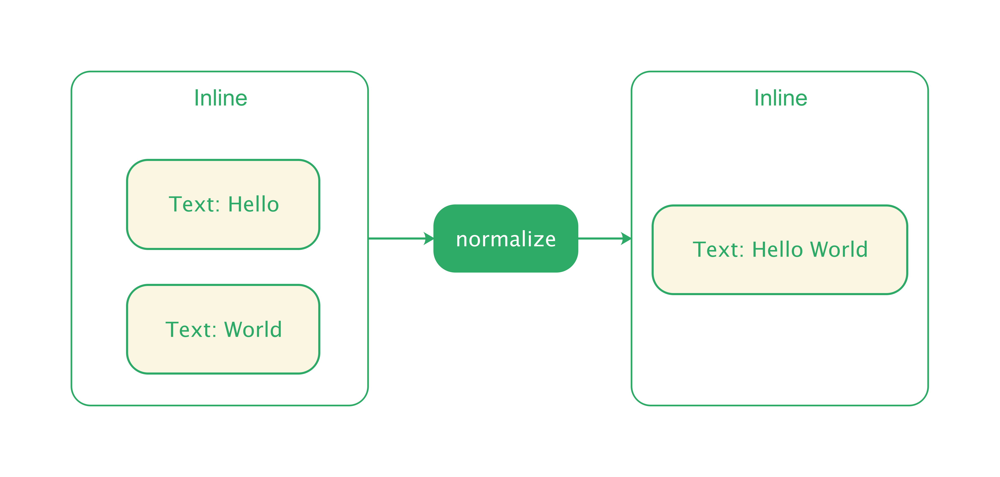
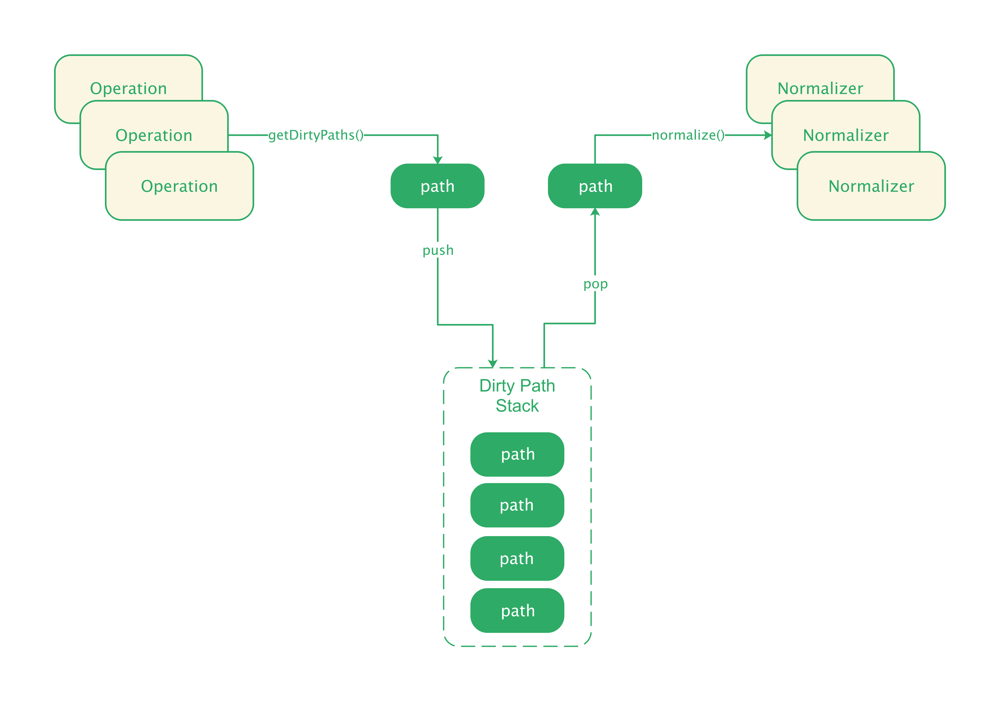
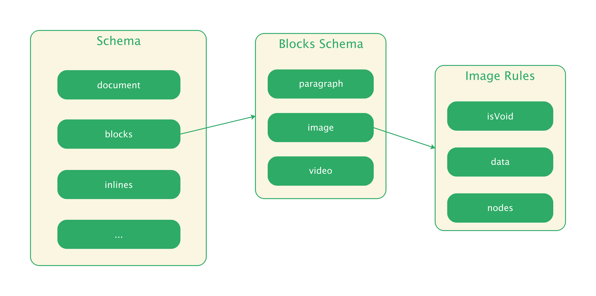
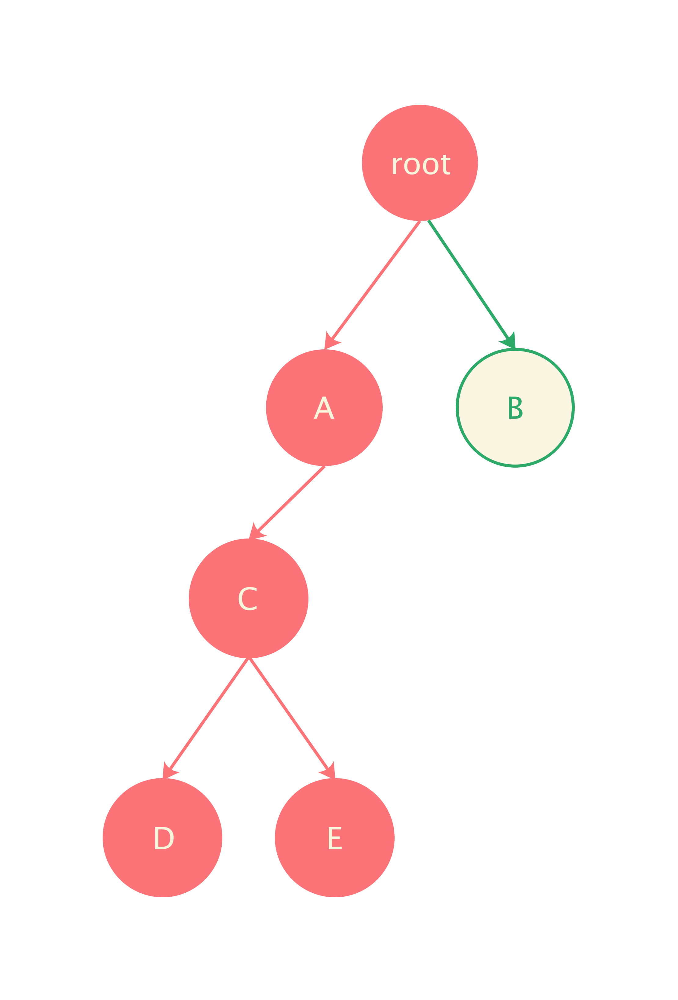
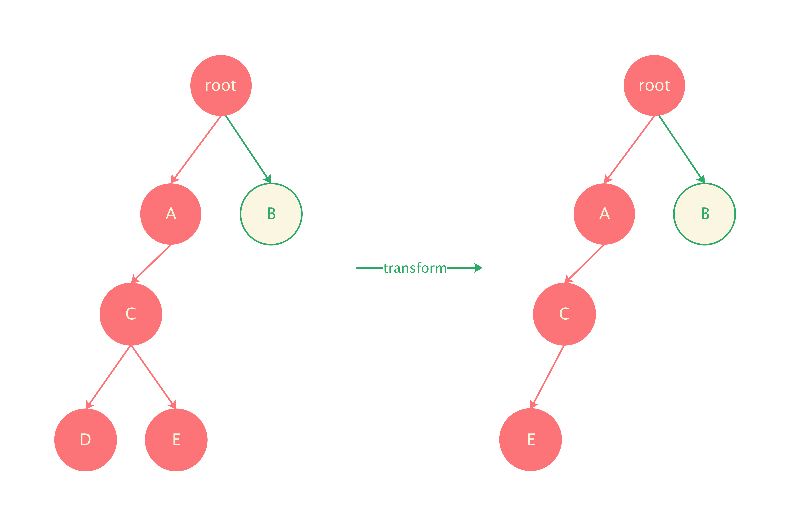

# Normalize

## 什么是 normalize

在 [编辑器模型]() 一节中，我们介绍过，HTML Element 可以通过 `normalize` 方法实现节点的标准化，例如合并多个文本节点：

```js
const element = document.createElement('div');

element.appendChild(document.createTextNode('1 '));
element.appendChild(document.createTextNode('2 '));
element.appendChild(document.createTextNode('3 '));

element.childNodes;  // NodeList [text, text, text]
element.textContent; // 1 2 3 

element.normalize();
element.childNodes;  // NodeList [text]
element.textContent; // 1 2 3
```

Normalize，顾名思义，就是对 HTML 进行「标准化」操作。通常，我们也需要为编辑器定义一套标准，例如：

- 不能出现连续的格式相同的文本

一旦制定了文档标准，那么任何对文档的操作，都应当满足：

- 指令执行前：基于符合标准的文档
- 指令执行后：产出符合标准的文档

<p align="center">
  
</p>


## Slate.js 中的 normalize

让文档能够符合标准，我们可以对指令相关指令做修改，例如要符合 “不能出现连续的格式相同的文本”，一种方式是，直接修改 `insertText` 指令的实现：

```js
Commands.insertText = (controller, text, marks) => {
	// ...
  // 插入文本后，判断插入的文本是否能够与前后文本合并
}
```

这种方式需要侵入到指令的实现，并且，为了实现「开发者自定义规则」，还需要将每个指令暴露为 hook，让开发者侵入逻辑进行文档校正。显然，这不是一个好的方式。Slate.js 也没有采用这样的方式实现 normalize，它是在指令完成时对受到指令影响的节点做 normalize。

<p align="center">
  
</p>
更具体地，Slate.js normalize 的过程是：


- 每个指令生成的若干 Operation，Slate.js 都会采集这些 Operation 影响到的路径，并把这些路径标记为脏路径（dirty path），放入脏路径栈

  ```js
  class Editor {
    // ...
    applyOperation(operation) {
      // ...
      
      // 标记受影响的节点路径为脏路径
      const newDirtyPaths = getDirtyPaths(operation)
      const dirty = this.tmp.dirty.reduce((memo, path) => {
        path = PathUtils.create(path)
        const transformed = PathUtils.transform(path, operation)
        memo = memo.concat(transformed.toArray())
        return memo
      }, newDirtyPaths)
  
      this.tmp.dirty = dirty
  
      // ...
      return controller
    }
  
  }
  ```

- 当指令执行完毕，Slate.js 会沿着脏路径来做 normalize:

  ```js
  class Editor {
      // ...
      command(type, ...args) {
        const { controller } = this
        // ...
        const obj = { type, args }
        this.run('onCommand', obj)
        // 根据脏路径做 normalize
        normalizeDirtyPaths(this)
        return controller
    }
  }
  ```

- `normalizeDirtyPaths` 的过程，就是将脏路径依次出栈，判读对应路径的节点是否违反了了某个规则，若是，则对脏路径上的节点调用其 `normalize` 方法进行校正（由于可能定义出错误的规则，导致节点的 normalize 一直失败，因此 Slate.js 也对节点的 normalize 限制了次数）：

  ```js
  // packags/plugins/slate/controllers/editor.js
  
  function normalizeDirtyPaths(editor) {
    // ...
    editor.withoutNormalizing(() => {
      while (editor.tmp.dirty.length) {
        const path = editor.tmp.dirty.pop()
        normalizeNodeByPath(editor, path)
      }
    })
  }
  
  function normalizeNodeByPath(editor, path) {
    const { controller } = editor
    let { value } = editor
    let { document } = value
    let node = document.assertNode(path)
    let iterations = 0
    const max = 100 + (node.object === 'text' ? 1 : node.nodes.size)
  
    while (node) {
      // 获得节点的 normalizer
      const fn = node.normalize(controller)
  
      if (!fn) {
        break
      }
  
      // 通过 normalizer 进行校正
      fn(controller)
  
      // 如果不符合规则的节点被删除了，即代表 normalize 完成了
      value = editor.value
      document = value.document
      const { key } = node
      let found = document.getDescendant(path)
  
      if (found && found.key === key) {
        node = found
      } else {
        found = document.getDescendant(key)
  
        if (found) {
          node = found
          path = document.getPath(key)
        } else {
          break
        }
      }
  
      iterations++
  
      // 限制最大迭代次数
      if (iterations > max) {
        throw new Error(
          'A schema rule ...'
        )
      }
    }
  }
  ```

## Schema

Slate.js 使用 schema 来表示文档要满足的标准。如果是简单的规则，我们可以声明式地配置：

<p align="center">
  
</p>

```js
const schema = {
  blocks: {
    image: {
      isVoid: true,
      data: {
        src: v => v && isUrl(v),
      }
    }
  }
}
```

这份 schema 就告诉了 Slate.js，image 节点应当满足的规则：

* 应当是一个 void 节点（不能包含有内容）
*  data 中的 url 应当是合法的链接地址 

如果我们插入的 image block 违反了这个规则，Slate.js 默认（默认的 schema 配置）会删除这个 block：

```js
// packages/slate/plugins/schema.js
function defaultNormalize() {
const { code, node, child, next, previous, key, mark } = error

  switch (code) {
    // 节点 data 不合法时的操作
    case 'node_data_invalid': {
      return node.data.get(key) === undefined && node.object !== 'document'
        ? editor.removeNodeByKey(node.key)
        : editor.setNodeByKey(node.key, { data: node.data.delete(key) })
    }

    // ...
    default: {
      return editor.removeNodeByKey(node.key)
    }
  }
}

```

Slate.js 默认行为如果不是我们期望的，我们还能自行实现节点的 `normalize` 方法。比如这个例子中，我们希望 image block 违反了规则时，就替代为一个默认的 image block，可以这么做：

```js
const schema = {
  blocks: {
    image: {
      isVoid: true,
      data: {
        src: v => v && isUrl(v),
      },
      normalize: (controller, error) {
        if (error.code === 'node_data_invalid') {
        	controller.setNodeByKey(error.node.key, {
    				type: 'image',
            data: {
    					src: 'https://default.png'
 	 					}
  				})
  			}
      }
    }
  }
}
```

## normalizeNode

声明式地规则配置并不能应付所有场景，对于更复杂的节点校验，开发者可以为插件实现 `normalizeNode` 方法：

```js
const Plugin = () => ({
  normalizeNode: (node, controller, next) {
    const { nodes } = node
    if (node.object !== 'block') return next()
    if (nodes.size !== 3) return next()
    if (nodes.first().object !== 'text') return next()
    if (nodes.last().object !== 'text') return next()
      return () => editor.removeNodeByKey(node.key)
    }
})
```

每次 Slate.js 指令执行完成并进行 normalize 时，调用 `node.normalize()` 时，都会依序调用插件中的 `normalizeNode` 方法对节点进行 normalize：

```js
class NodeInterface {
  // ...
  normalize(editor) {
    const normalizer = editor.run('normalizeNode', this)
    return normalizer
  }
}
```

## 脏路径生成

如何任何文档内容的变更，都要对文档树做一次全量的 normalize，开销就特别大，尤其是在大文档下，用户的每个操作都会被延迟响应。

因此，为了缩减 normalize 的范围，加快 normalize 执行效率，Slate.js 就需要标记当前操作影响了哪些节点，受影响的路径被标记为脏路径（dirty path）。以删除节点这个 Operation 为例，被删除的节点祖先都会被标记为脏（被删除的节点路径则因为已经被删除了，不需要进行 normalize，也就不需要被标记）。

再看一个更具体地例子，假定我们执行了插入节点的操作，这个操作会在路径 `[0,0]` 添加了节点 C：

```js
{
  type: 'insert_node',
  path: [0,0]，
  node: {
    // ...
  }
}
```

受到该操作变脏了的路径就包括了：节点 C 的祖先，节点 C，以及节点 C 的子孙：

```
[], [0], [0,0], [0,0,0], [0,0,1]
```

<p align="center">
	
</p>


此后，又生成了一个删除节点 D 的 Operation：

```js
{
  type: 'remove_node',
  path: [0,0,0]
}
```

对应的脏路径就包括节点 D 的祖先：

```
[], [0], [0,0]
```

<p align="center">
	
</p>

如果我们直接将删除节点 D 的 Operation 放入脏路径栈中，最终脏路径栈就会是：

```
// remove_node
[]
[0]
[0,0]
// insert_node
[]
[0]
[0,0]
[0,0,0]
[0,0,1]
```

将路径依次出栈进行 normalize，当取出 `[0,0,0]` 时，由于路径对应的节点已经被删除，所以对 `[0,0,0]` 的 normalize 将没有意义。

## 路径转换

在这个例子中，我们发现，「新到来的 Operation 会对已经生成的脏路径造成影响」，因此不能直接将该 Operation 生成的脏路径入栈，而应当「基于这个 Operation，先对栈中已有的脏路径做修正」，Slate.js 的 PathUtils 中提供了 `transform(path, operation)` 函数来完成这个工作：

```js
function transform(path, operation) {
  const { type, position, path: p } = operation

  if (
    type === 'add_mark' ||
    type === 'insert_text' ||
    type === 'remove_mark' ||
    type === 'remove_text' ||
    type === 'set_mark' ||
    type === 'set_node' ||
    type === 'set_selection' ||
    type === 'set_value' ||
    path.size === 0
  ) {
    return List([path])
  }

  const pIndex = p.size - 1
  const pEqual = isEqual(p, path)
  const pYounger = isYounger(p, path)
  const pAbove = isAbove(p, path)

  if (type === 'insert_node') {
    if (pEqual || pYounger || pAbove) {
      path = increment(path, 1, pIndex)
    }
  }

 // ...
}
```

这个函数是非常复杂的，需要根据当前 Operation 操作的位置和 path 的空间关系，对 path 进行不同的转换（截止 Slate.js 0.50.x 版本，这个路径转换也一直在完善）。

上例中，当删除节点 D 的 Operation 到来时，插入节点 C 阶段生成的脏路径就会被转换为：

<p align="center">
  
</p>

最终，normalize 的范围就是：

```
[]
[0]
[0,0]
[0,0,0]
```

