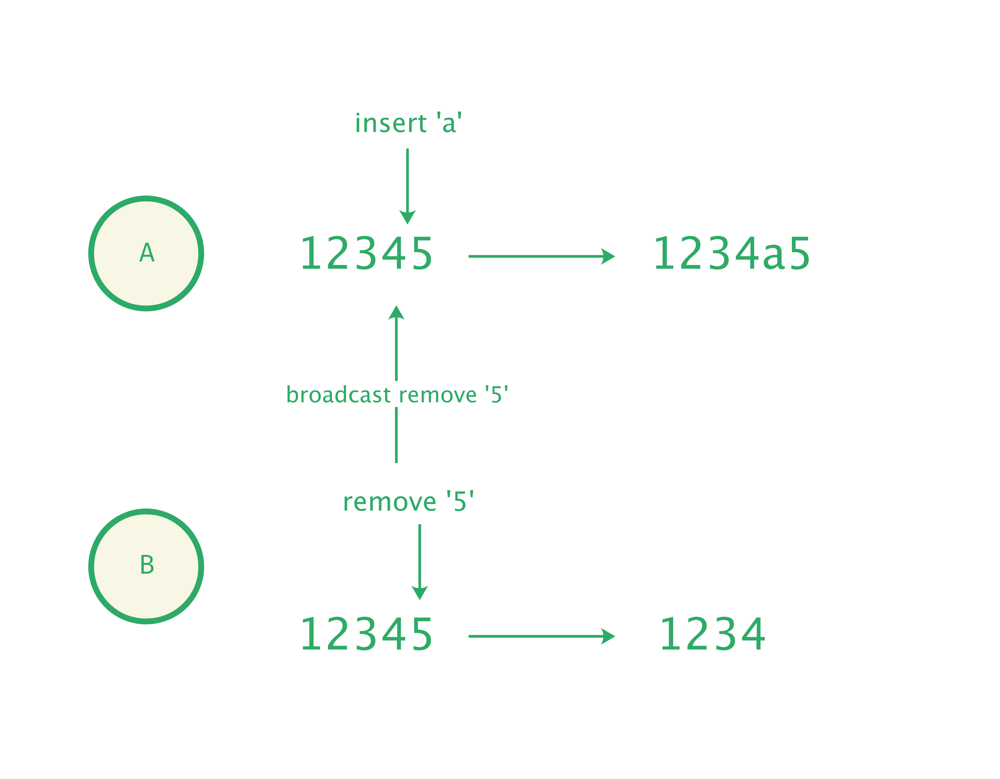

# Operation

当我们执行了一条指令之后，并不会直接生成新的文档模型，假设我们以文档模型为最小抽象，那么考虑在多人协同场景下，用户 A 和用户 B 同时编辑一篇文档，这篇文档的内容是 `12345`：

- A 调用 `insertText ` 指令在 `4` 后面插入了文本 `a`，生成了新的文档 `1234a5`
- B 调用 `removeText` 指令删除了 `5`，生成了新的文档 `1234`
- B 生成的新文档被广播给了 A

当 A、B 执行完各自的操作后，对于多人协作文档来说，期望每个用户「彼时彼刻都看到同样的内容」。当 A 拿到了 B 的文档 `1234` 后，它应该作何反应，才能计算出一篇 A、B 看到一样结果的内容？显然，A 首先需要知道 B 做了什么操作，为此，它就会计算 `12345 ` 与 `1234` 的 diff，推演出 B 是做了删除了 `5` 的动作。

<p align="center">
  
</p>

以文档模型作为最小抽象，绕不开：

- 协同时「传输对象是整个文档」
- 协同时总要「计算本地文档和远端文档的 diff」

既然如此，预期告诉对方自己生成了怎样的内容，不如再细致一点，告诉对方自己执行了怎样的操作：

- A 告诉 B：自己在文本 `12345` 的第 4 个位置插入了文本 `a`
- B 告诉 A：自己删除了文本 `12345` 的第 4 个位置的文本

这样节约带宽的同时，也省却了对文档的 diff 的计算：

<p align="center">
  
</p>

Slate.js 即使用了 Operation 作为文档的最小抽象：指令调用的结果，并非直接生成一篇新的文档，而是生成一系列不同类型的 Operation：

| 类型 type                 | 携带信息 payload                                             |
| :------------------------ | ------------------------------------------------------------ |
| 插入文本：Insert Text     | 所在节点（path），插入内容（text），偏移量（offset），文本含有格式（marks） |
| 删除文本：Remove Text     | 所在节点（path），删除内容（text），偏移量（offset），文本含有格式（marks） |
| 设置文本格式：Set Mark    | 所在节点（path），偏移量（offset），区间长度（length），格式（mark），格式属性（properties） |
| 添加文本格式：Add Mark    | 所在节点（path），偏移量（offset），区间长度（length），添加格式（mark） |
| 删除文本格式：Remove Mark | 所在节点（path），偏移量（offset），区间长度（length），删除格式（mark） |
| 设置节点属性：Set Node    | 所在节点（path），被设置节点（node），节点属性（properties） |
| 插入节点：Insert Node     | 插入位置（path），插入节点（node）                           |
| 删除节点：Remove Node     | 删除位置（path），删除节点（node）                           |
| 移动节点：Move Node       | 移动位置（path），移动目的地（newPath）                      |
| 合并节点：Merge Node      | 待合并的节点（path），合并目的地位置（position），合并后节点属性（properties） |
| 断开节点：Split Node      | 断开的节点（path），分裂位置（position），分裂后节点属性（properties） |

指令会生成若干个操作，逐个应用这些操作到文档模型，即可获得最新的文档：

```js
const { value: newValue } = operations.reduce(
  (value, op) => controller.applyOperation(op), 
  editor.value
)
```

