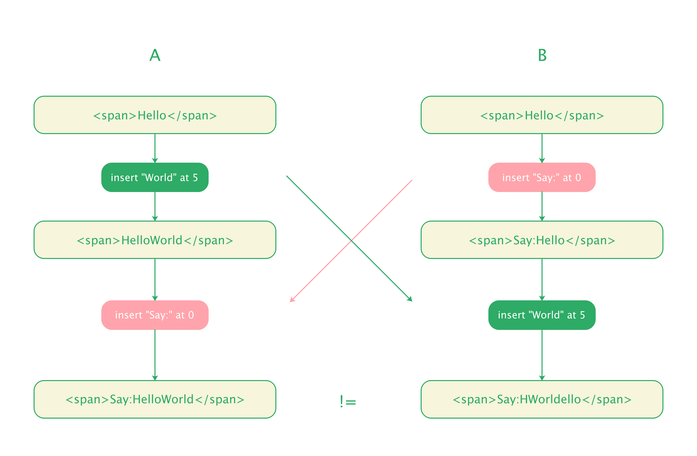
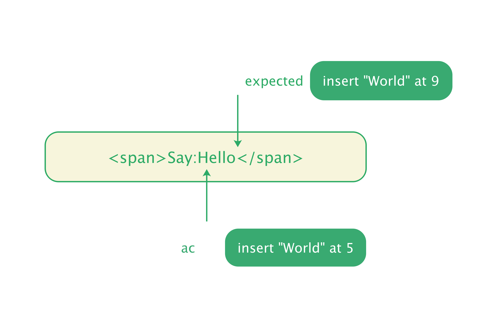
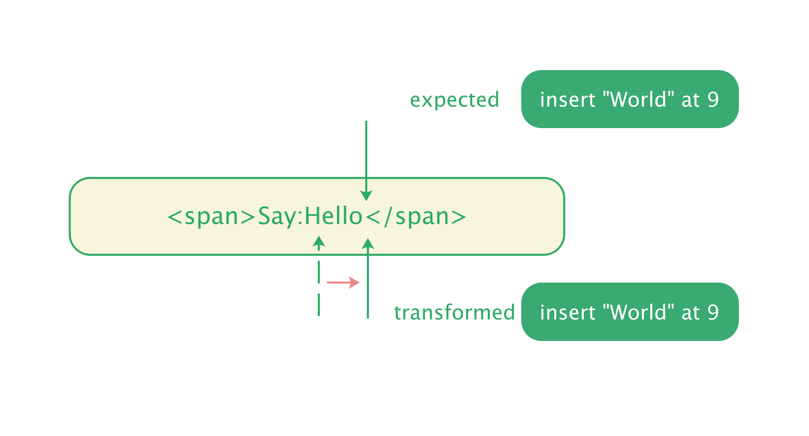

# 协同基石 - OT 算法

## 有了 OP，就能够协同？

在上文 [Slate.js 是如何支持协同的？](./how-editor-be-collaborative.md) 中，我们展示了一个协同编辑的例子，最终 A、B 用户的文档没有收敛为一致，亦即应用了对方操作后，他们没能看到相同的文档：

<div style="text-align: center">
  
</div>


我们再回顾下 A、B 各自对文档的变更：

```js
// A's op
{ type: 'insert_text', path: [0,0], offset: 5, text: 'World', marks: [] }
// B's op
{ type: 'insert_text', path: [0,0], offset: 0, text: 'Say:', marks: [] }
```


A 的操作意为：在路径为 [0,0] 的节点的第 **5** 个位置插入 'World'。我们之所以直接应用了 A 的操作到 B，是因为我们：

> 孤立地看待了 Operation，忽视了 Operation 的上下文」

而这里 A 操作的上下文就是操作生成时的文档内容：

```html
<span>Hello</span>
```


当 A 的操作到达 B 时，B 的内容已经是：

```html
<span>Say:Hello</span>
```


这个内容已经不是 A 操作产生时的上下文了，A 操作携带的空间信息，例如 path, offset 等也并非产自这个上下文。A 操作生成时，offset 5 位于：

```html
Hello<offset />
```

而当前 offset 5 则位于：

```html
Say:H<offset />
```

直接在这个内容上应用 A 操作，自然不是应用在预期的空间上了，结果也无法保证了。

<div style="text-align: center">
  
</div>

当 Operation 不认识当前的上下文时，我们可以根据当前文档发生的变更，对它做调整，以适应当前的上下文后再应用它。回到例子中另 A 的操作为 Oa，另 B 的操作为 Ob，Oa 知道 Ob 在 [0,0] 位置插入了文本 `Say:`，也就知道了 Ob 在 [0,0] 开头增加了长度为 4 的字符串，那么我们就后移 Oa 的 offset 4 个长度，就将 Oa 调整到了期望的位置，我们另其为 Oa'：

```js
{ type: 'insert_text', path: [0,0], offset: 9, text: 'World', marks: [] } // Oa'
```

<div style="text-align: center">
  
</div>

同理，在 A 站点，调整后的 Ob' 为：

```js
{ type 'insert_text', path: [0, 0], offset: 0, text: 'Say:0', marks: []} // Ob'
```


分别在 A 站点应用 Ob'，B 站点应用 Oa'，将获得一致的内容：

```html
<span>Say:HelloWorld</span>
```

<div style="text-align: center">
  
</div>


这也引出了本文要介绍的 [Opeartional Transformation](https://www.wikiwand.com/en/Operational_transformation)，即操作变换，简称 OT。当协作者变更到来时，需要变换操作以适应当前上下文，才能直接应用。而调整的过程，则基于当前文档已经发生的变更：

```
Oa' = OT(Ob, Oa) // 基于已有的操作 Ob，变换 Oa 为 Oa'，以适应当前上下文
```


假设我们的操作只针对一个字符串，含有:

* 插入文本操作： insert  `text` at `offset`
* 删除文本操作： delete `text` at `offset`


对应这两种的 OT 算法易得：

```ts
function ot(prevOp, op) {
  // 在 op 之前插入，需要向后移动 op 作用的 offset
  if (prevOP.type === 'insert' && prevOp.offset <= op) {
    return { ...op, offset: op.offset + prevOp.text.length };
  } 
  // 在 op 之前删除，需要向前移动 op 作用的 offset
  if (prevOp.type === 'delete' && prevOp.offset <= op.offset) {
    return { ...op, offset: op.offset - prevOp.text.length };
  }
    
  return op;
}
```


## 什么时候做 OT

我们让例子稍微复杂一些，假如 B 对文档有两个变更分别为 Ob1 和 Ob2：

```ts
{ type: 'insert_text', path: [0,0], offset: 0, text: 'Say:', marks: [] } // Ob1
{ type: 'remove_text', path: [0,0], offset: 3, text: ':', marks: [] } // Ob2
```


A 的操作到达 B 后，又该怎样的调整呢？如果 Oa 基于 B 站点最新的操作 Ob2 做 OT，变换后的 Oa' 就为：

```js
{ type: 'insert_text', path: [0,0], offset: 4, text: 'World', marks: [] }
```


在 B 应用 Oa' 得到新的内容：

```html
<span>SayHWorldello</span>
```


还是出现了内容分叉，因此我们也不难得出，OT 是有使用限制的。两个 OP 在进行 OT 时，本质上就是一个 OP 向另一个 OP 问询信息：

> 你对文档做了什么？

知道对方 ”所作所为“，我才知道如何对自己 ”脱胎换骨“。两个 OP 能够进行 OT 的前提是：**它们产生自相同上下文**。只有产生自相同上下文，彼此通信的空间信息才是彼此信赖、可理解的，也才敢使用彼此的信息调整自己。


以上例来说，Oa' 之所以不符合预期，是因为 Ob2 产生自内容：

```html
<span>Say:Hello</span>
```


此时它携带的上下文和空间信息，已经不是 Oa 产生时候的上下文了，这些信息给到 Oa 也就没有意义了。强行为二者做 OT，也就让 Oa 使用了不能理解的空间信息调整自身，最终产生了错误的结果。


因此，要先保证 OP 是生成自同一个上下文，才能进行信息交换和操作变化。上例中，合法的过程应该是：


1. 因为 Oa、Ob 产生自相同的上下文，二者可以 OT，得到：

   ```
   Oa' = OT(Ob1, Oa)  // Oa' is { ..., offset: 9 }
   ```

   

2. OT 得到的结果 Oa' 能够应用在 Ob 应用之后的上下文，也就是其产生于 Ob1 作用后上下文，和产生 Ob2 的上下文等价。因此，我们基于 Ob2，再对 Oa' 做 OT，得到 Oa''：

   ```
   Oa'' = OT(Ob2, Oa') // Oa'' is { ..., offset: 8 }
   ```

   

产生 Oa'' 的上下文，也就是 Ob2 作用后的上下文，即 B 站点当前的上下文，因此可以将其应用到站点 B，最终获得结果：

```html
<span>SayHelloWorld</span>
```

<div style="text-align: center">
  
</div>


## 怎么处理对多个操作进行变换

我们再让例子复杂一些，如果 A 站点也产生了两个操作 Oa1 和 Oa2：


```js
{ type: 'insert_text', path: [0,0], offset: 5, text: 'World', marks: [] } // Oa1
{ type: 'insert_text', path: [0,0], offset: 10, text: '!', marks: [] }    // Oa2
```


当 Oa1, Oa2 两个操作到达站点 B 后，那么，最终能够被应用到站点 B 的操作又该是怎样的呢？我们先回顾下上文中陈述的两个关键前提和条件：

* **应用前提**：OP 只有在产生自当前上下文时，才能够被应用
* **变换前提**：两个 OP 只有在产生自相同上下文时，才能够被应用


那么，我们最终得到能够被应用的协作者 OP 的过程就可以概括为：


* 找到可以做 OT 的 OP，从它那里获得有效信息，进行操作变换
* 重复上述过程，直到 OP 变换到当前上下文可用


令：

* S(x,y) 表示在位置 (x,y) 的文档状态，x, y 分别表示 A, B 站点的状态
* A(x,y) 表示客户端 A 在状态 S(x,y) 下产生的操作
* B(x,y) 表示客户端 B 在状态 S(x,y) 下产生的操作

则：

* A(0,0) 和 B(0,0) 就分别表示了在 S(0,0) 下产生的操作，由于产生自相同上下文，二者可以进行 OT。

* S(x,y) 状态下，可应用 A(x,y) 和 B(x,y)，分别得到状态：

  ```
  S(x,y) ο A(x,y) = S(x+1,y)
  S(x,y) ο B(x,y) = S(x,y+1)
  ```

> 符号 ο 代表 apply op


那么上例中，A、B 要得到能够应用在各自站点的协作者的操作，过程就是：

1. 初始状态为 S(0,0)
   a. A 执行了操作 A(0,0)，状态更新为 S(1,0)。再执行 A(1,0)，状态更新为 S(2,0)
   b. B 执行了操作 B(0,0)，状态更新为 S(0,1)。再执行 B(0,1)，状态更新为 S(0,2)
<div style="text-align:center">
  
</div>
2. A(0,0) 基于 B(0,0) 做 OT，得到可在状态 S(0,1) 上应用的 A(0,1)
<div style="text-align:center">
  
</div>
3. A(0,1) 基于 B(0,1) 做 OT，得到可在状态 S(0,2) 上应用的 A(0,2)
<div style="text-align:center">
  
</div>
4. B(0,0) 基于 A(0,0) 做 OT，得到可在状态 S(1,0) 上应用的 B(1,0)
<div style="text-align:center">
  
</div>
4. B(1,0) 基于 A(1,0) 做 OT，得到可在状态 S(2,0) 上应用的 B(2,0)
<div style="text-align:center">
  
</div>
5. ...

最终，变化过程形如一个棋盘：
<div style="text-align:center">
  
</div>

* 站点 B，此时状态为 S(0,2)，我们得到了变换后的协同者操作 A(0,2) 与 A(1,2)，最终状态步进到了 S(2,2)

  ```
  S(0,2) ο A(0,2) ο A(1,2) = S(1,2) ο A(1,2) = S(2,2)
  ```

* 站点 A，此时状态为 S(2,0)，我们得到了变换后的协同者操作 B(2,0) 与 B(2,1)，最终状态也步进到了 S(2,2)

  ```
  S(2,0) ο B(2,0) ο B(2,1) = S(2,1) ο B(2,1) = S(2,2)
  ```

  

棋盘的边也分别展示了 A、B 站点应用 OP 的路径：

* 站点 A：`A(0,0) --> A(1,0) --> B(2,0) --> B(2,1)`
* 站点 B：`B(0,1) --> B(0,2) --> A(0,2) --> A(1,2)`

## 完善我们的 OT 算法

上例中，我们看到，在 A、B 站点各自形成了两条操作应用路径，都达到了状态 S(2,2)。但是是否就有 Sa(2,2) == Sb(2,2) 呢？即 A、B 能看到同样的内容？

我们再看一个例子，假定初始内容为空，A、B 分别执行了操作操作 Oa, Ob：

```
Oa: insert '1' at 0
Ob: insert '2' at 0
```

应用我们前文设计的 OT 算法和 OT 过程，得到：

```
Oa': insert '1' at 0,
Ob': insert '2' at 0
```

那么 A、B 各自应用转换后的 OP，得到的内容分别就是：
* A 站点的内容：`Sa ο Ob' = '21'` 
* B 站点的内容：`Sb ο Oa' = '12'`

<div style="text-align: center">
  
</div>

最终还是出现了各站点内容不一致。因此，为了实现内容的一致，我们需要让 OT 算法满足：

```
Sa ο OT(Ob, Oa) = Sb ο OT(Oa, Ob)
```

为此，我们修改 OT 算法，当操作在同一个位置进行插入时，比较文本的字母序确定优先级：

```ts
function ot(prevOp, op) {
  if (prevOp.type === 'insert') {
    // 在 op 之前插入，需要向后移动 op 作用的 offset
    if (prevOp.offset < op.offset) {
      return { ...op, offset: op.offset + prevOp.text.length };
    }
    
    // 在相同位置插入，比较文本的字母序
    if (prevOp.offset === op.offset && op.text > prevOp.text) {
      return { ...op, offset: op.offset + prevOp.text.length}
    }
  } 
  // ...
    
  return op;
}
```

现在，应用新的 OT 算法后，转换后 Oa'、Ob' 就分别是：

```
Oa': insert '1' at 0,
Ob': insert '2' at 1
```

在 A、B 站点分别应用 Ob' 和 Oa'，最后都将看到内容 '12'。
<div style="text-align: center">
  
</div>

由此可见，OT 算法的约束和实现将极大影响协作内容的正确性，这里我们仅仅举例了简单文本操作的 OT 算法，对于那些更复杂的协同系统，对 OT 算法的要求还要更高。


## 小结

本文简要介绍了 OT 算法，与其他文章不同的是，本文没有一上来就引申 OT 定义，OT 定律等等，也没有罗列各种 OT 系统和 OT 实现，因为笔者更像让大家知道，为什么协作编辑不是简单应用协作者操作即可？为什么要有操作变换？什么时候能应用 OP，什么时候能进行 OT。笔者也建议读者在学习一个技术时，先了解其动机，当你知道了一个技术的来由时，其实现甚至都有可能 “跃然纸上” 了。

故而 OT 算法也不会在本文戛然而止，不同的协同系统，该设计怎样的 OT 算法，面对怎么样的苦难，这些超出了本文撰述的范围。若读者想要深一步认识和学习 OT 算法设计，推荐南阳理工大学 [Chengzheng Sun](http://www.ntu.edu.sg/home/czsun/) 教授撰写的 [OT FAQ](https://www3.ntu.edu.sg/scse/staff/czsun/projects/otfaq/)。而如果你是一个期望为 Slate.js 集成 OT 能力的开发者，也可以阅读 [slate-ot](https://github.com/solidoc/slate-ot) 的实现，尤其可以通过阅读单元测试，了解到 OT 算法处理的场景和范围。


## 参考资料

* [OT FAQ](https://www3.ntu.edu.sg/scse/staff/czsun/projects/otfaq/)

* [Wiki - Operational Transformation](https://www.wikiwand.com/en/Operational_transformation)