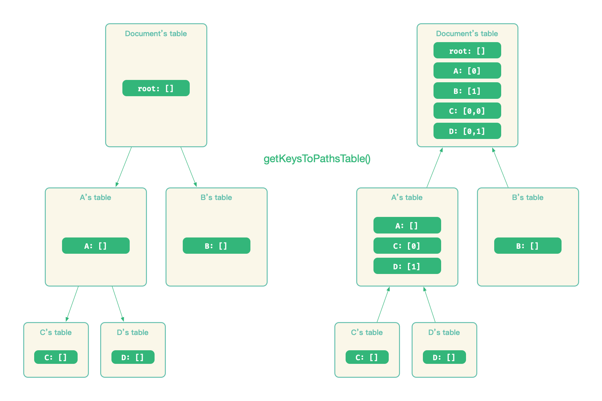

# 节点寻址

## key：节点索引

当节点被创建后，Slate.js 会为其分配一个 key 作为唯一索引，默认是一个单调自增数：

```
1
2
3
```

「一旦节点生成，他的  key 是稳定且唯一的，无论文档结构发生了怎样的变化」，只在部分情况下，会需要重新为节点生成 key，例如一个 Text 节点分裂后，为了避免分裂后的两个 Text 节点共享分裂前的 key，需要为分裂后节点重新生成 key。

Slate.js 提供了一系列基于 key 的 API 给开发者，去访问或者操作节点：

```js
editor.moveNodeByKey(key)
editor.removeNodeByKey(key)
editor.replaceNodeByKey(key)
```

## path：节点在文档中的位置

`key` 作为节点的索引，不依赖于文档结构而存在，因此，它「没有反映节点位置的能力」。如果我们要按照 key 来寻找节点，就要全量遍历当前节点树，知道找到对应 key 的节点为止，对于一个非常大的文档来说，这样的查询开销是非常大的。

为此，Slate.js 设计了「Path」 这个模型去描述节点位置，它是一个 Immutable List 对象，一个数字数组。

给定一个节点的路径  `[i, j]` ，从根节点开始，先到达根节点子孙中的第 `i` 个节点 `Node_i`，再到达 `Node_i` 的第 `j` 个节点 `Node_i_j` ，我们就找到了这个基点。例如沿着路径`[0,1]`，在下面这个节点树种，我们就能找到节点 D：

<p align="center">
	
</p>

比较特殊的是，`[]` 表示了根节点的路径。

当给定一个节点的路径 [i,j,k] 后，我们很容易就能获得他的祖先和兄弟路径：

- 祖先: `[], [i], [i,j]`
- 兄弟：`[i, j, x] where x is not k`

## Path Utils

Slate.js 为 Path 配套了一系列的工具函数，这些工具函数可以分类为：

- 处理路径关系的：例如 `Path.isAfter(path, target)` 等
- 变更路径的：例如 `Path.increment(path, n, index)` 等
- 执行路径转换的：`PathUtils.transform(path, operation)`，这个函数非常重要，它是进行 normalize 和协同编辑的前提，我们在 [normalize](./normalize) 一节中会介绍它

## key 与 path 的转换

当开发者调用 `xxByKey()` 的 API 时，Slate.js  会先根据 key 查找到节点的路径，顺着节点路径找到节点后执行对应操作，这个查找的过程以 `getPath(key)` 为名封装在了 Node Interface 中：

```js
class Node {
  // ...
  getPath(key) {
      // ...
      const dict = this.getKeysToPathsTable()
      const path = dict[key]
      return path ? List(path) : null
  }
  
  getKeysToPathsTable() {
    const ret = {
      [this.key]: [],
    }

    if (this.nodes) {
      this.nodes.forEach((node, i) => {
        const nested = node.getKeysToPathsTable()

        for (const key in nested) {
          const path = nested[key]

          ret[key] = [i, ...path]
        }
      })
    }

    return ret
  }
  // ...
}
```

节点路径和当前节点树的结构有关，因此，每个节点都维护了一个其子孙的 key-to-path 的 Hash Table，`table[x]` 就表示了 key 为 `x` 的节点的相对路径。例如上例中的 A 节点，它拥有的 key-to-path table 就是：

```js
{
  "C": [0]
  "D": [1]
}
```

当调用 `document.getPath('C')` 来获得 C 节点的路径时，从 document 开始，所有子孙的 key-to-path table 都会被逐一构建：

<p align="center">
	
</p>

如果每次调用 `node.getPath(key)`  都要从节点开始构建节点以及子孙节点的 key-to-path table，当文档内容变大时，将会遇到非常严苛的性能挑战。

为此，Slate.js 对 `node.getKeysToPathsTable()`做了 memorize，当节点没有变化时，以相同的 key 查询路径，方法将直接返回最近一次的结果。

> 在 [memorize](./memozie.md) 一节中，我们介绍了 Slate.js 是如何使用缓存函数调用来优化性能的。


现在，Slate.js 中的模型差不多就介绍完了，接下来，我们看看，Slate.js 是如何让这份模型与终端用户进行互动的。