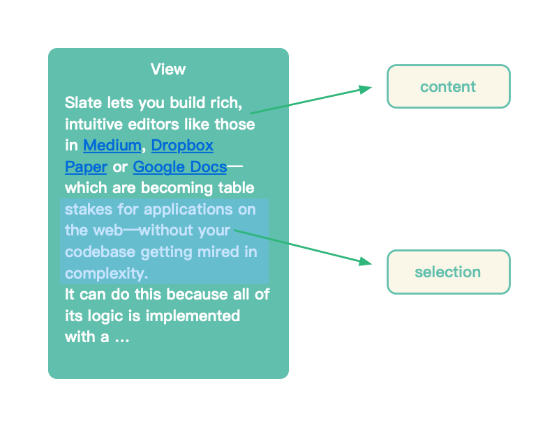
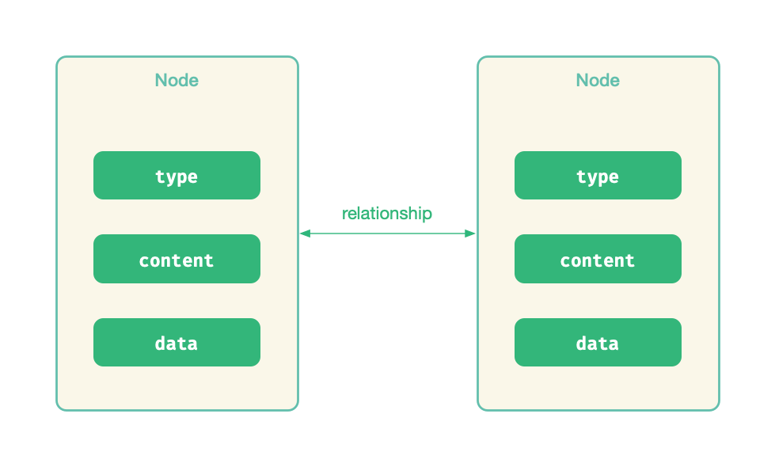
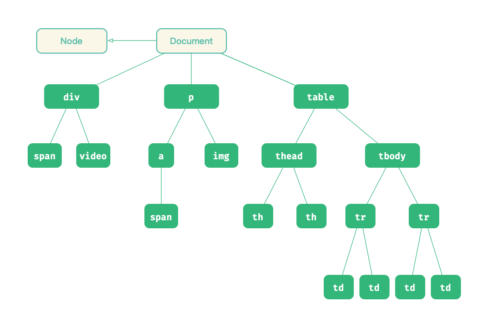
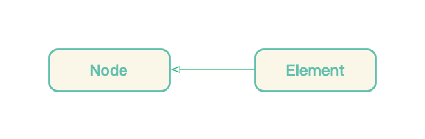
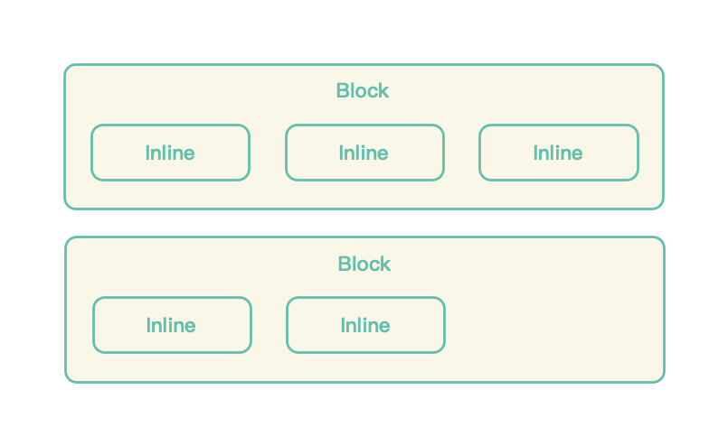
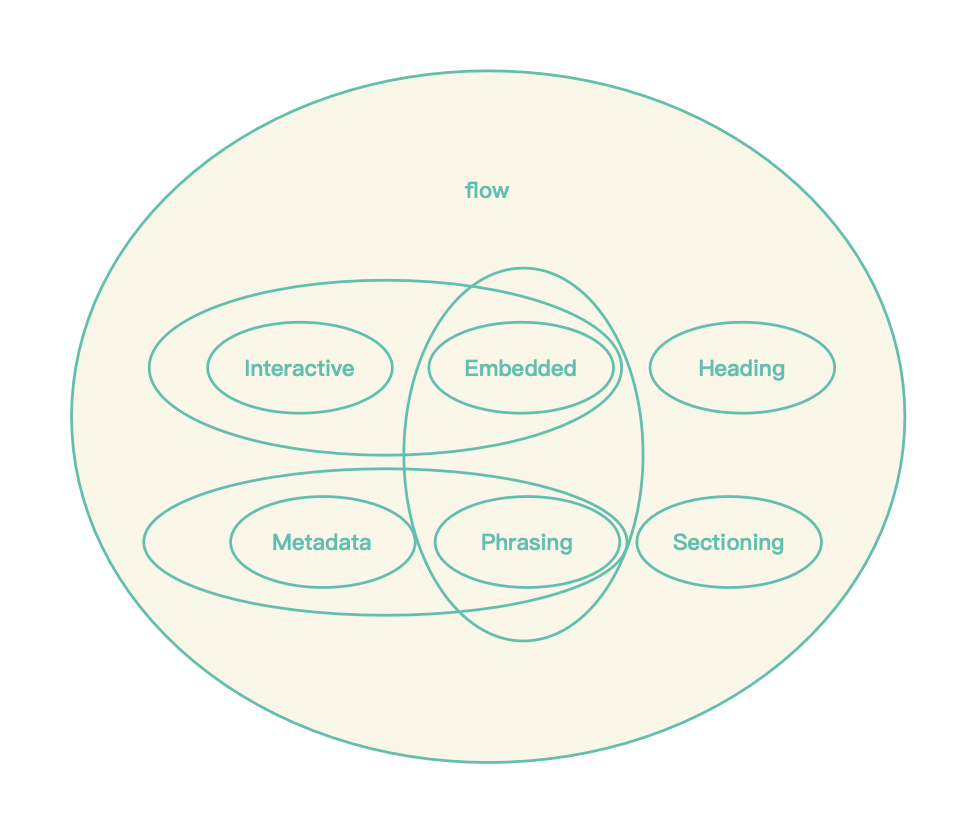
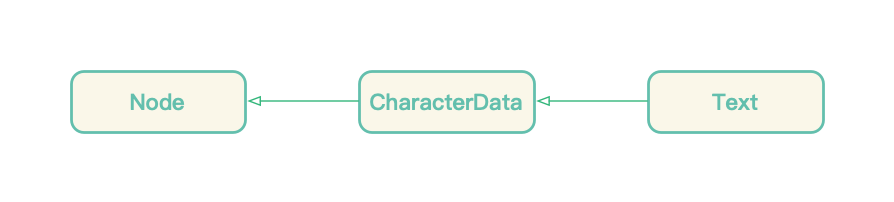
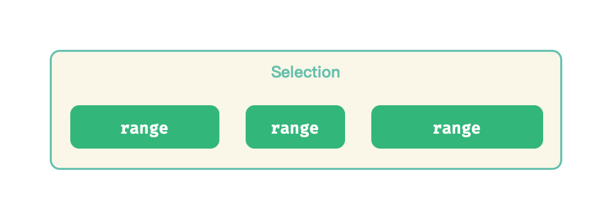
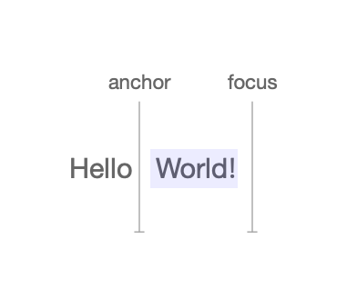
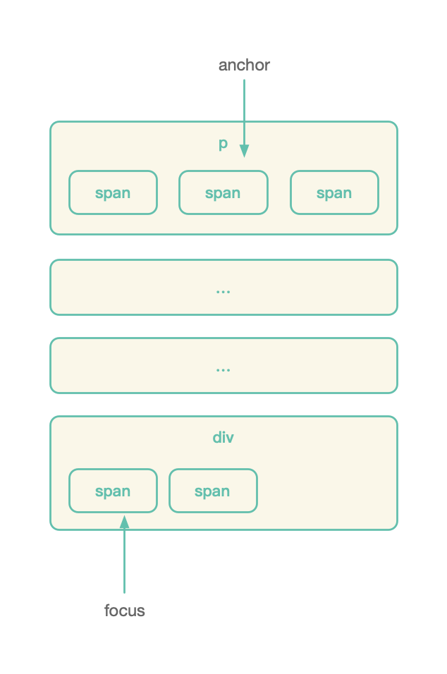

# HTML 中的富文本

<p align="center">
	
</p>
前文中我们提到，Web 富文本，其实就是一段 HTML 内容，它包含了两个方面：

- __节点（Node）__：节点容纳了我们能看到的富文本内容，富文本容器也是一个节点，容纳了其他节点
- __选区（Selection）__：当前选中的区域，如果区域的起点和终点重合，那看到就是一个光标

# 节点

富文本中的节点，我们需要考虑：

- 有哪些类型的节点
- 如何为节点绑定额外数据
- 节点与节点间的关系如何

<p align="center">
	
</p>


## 节点类型

在 HTML 现行规范中，[节点（Node）](https://dom.spec.whatwg.org/#interface-node)被定义为一个 Node Interface，它是一个抽象基类，继承自 Node Interface 的类将具备访问节点属性、修改节点结构的能力。

对于一个网页来说，继承自 Node 的 [Document](https://developer.mozilla.org/zh-CN/docs/Web/API/Document) 就别用来表示网页内容：

<p align="center">
	
</p>


在这颗 DOM 树中，挂载了不同类型的、实现了 [Element Interface](https://developer.mozilla.org/zh-CN/docs/Web/API/Element) 的节点，因此具有描述样式和尺寸的能力：

<p align="center">
	
</p>


```js
Element.classList
Element.styles
Element.clientHeight
Element.getBoundingClientRect()
Element.getComputedStyle()
```

我们常见的 `div`、`p`、`span` 等都继承自 [HTMLElement](https://developer.mozilla.org/zh-CN/docs/Web/API/HTMLElement)（它继承自 Element）。在 HTML 5 之前，HTMLElement 被分为了:

- **块级元素(Block Level Element)**：块级元素占据了父容器的整个空间，视觉上就是形成了一个 “块”。文档中每新增一个块，首先要新增一个容纳这个块的行。
- **行内元素(Inline Level Element)**：行内元素只占据了内容所需要的空间。

<p align="center">
	
</p>


而在 HTML 5 之后，HTMLElement 的按照[内容类别](https://developer.mozilla.org/en-US/docs/Web/Guide/HTML/Content_categories)进行了细化：

<p align="center">
	
</p>

## 节点文本

在 HTML 规范中， [Text Interface](https://dom.spec.whatwg.org/#text) 用来表示 Element 的文本内容，它继承自 [CharacterData](https://developer.mozilla.org/zh-CN/docs/Web/API/CharacterData) ，后者用于表示 Node 所包含的字符：

<p align="center">
	
</p>


我们可以通过 `Document.createTextNode()` 向节点中插入多个 Text，并通过 `Node.textContent` 访问节点的文本：

```js
const element = document.createElement('div');

element.appendChild(document.createTextNode('1 '));
element.appendChild(document.createTextNode('2 '));
element.appendChild(document.createTextNode('3 '));

element.childNodes; // NodeList [text, text, text]
element.textContent; // 1 2 3 
```

在上面这个例子中，我们创建了多个相邻的文本节点，以通过 `Node.normalize()` 还可以让这些文本节点合并为一个文本节点：

```js
element.normalize();

element.childNodes; // NodeList [text]
element.textContent; // 1 2 3 
```

[Void Element（空节点）](https://developer.mozilla.org/en-US/docs/Glossary/Empty_element)，也被称为 Empty Element，是一类特殊的 HTML Element，它不允许包含任何的内容。诸如 `<input />`、`<link />` 等都是 Void Element，尝试注入内容到 Void Element 是无效的：

```html
<p>
  <input value="12345">Content</input>
  Image</img>
</p>
```

## 节点数据

一个节点，除了可以含有文本内容，还能绑定一些额外数据。例如我们需要为图片节点设置图片源和尺寸信息，HTML `img` tag 为此提供了 `src` 、`width`、`height` 等属性。更一般地，我们可以通过 `data-*` 设置节点的数据：

```html
<pre
  id="code-block"
  data-syntax="javascript"
  data-theme="dracula"
/>
```

我们可以通过 `HTMLElement.dataset.xxx` 访问这些数据：

```js
const code = document.querySelector("code-block");

code.dataset.syntax; // javascript
code.dataset.theme; // dracula
```

## 节点关系

一篇 HTML 文档，可以被一棵 DOM 树所标识，DOM 树中的每个节点又是一个 DOM 子树，树节点就存在「祖先、孩子、兄弟」的关系。HTML 规范中，通过 Node Interface 定义了访问当前节点的父节点、孩子节点以及兄弟节点的方式：

```js
Node.parentNode;
Node.childNodes;
Node.previsousSibling;
Node.nextSibling;
```

这些 API 方便我们定位到树里面的某个节点。

# 选区

HTML 的中的选区，涉及了两个位面：

- Selection：用户视觉上所看到的选区
- Range：选区内部含有的 DOM 内容

<p align="center">
	
</p>

## Selection

[选区（Selection）](https://developer.mozilla.org/en-US/docs/Web/API/Selection)表示的是当前用户选中的内容：

<p align="center">
	
</p>


上图反映了表示一个选区的信息有：

- 选区的起点：起点反映了选区从哪个节点，哪个偏移位置开始
- 选区的终点：终点反映了选区从哪个节点，哪个偏移位置结束

因此，在 HTML 中，通过 `window.getSelection()` 可以获得当前窗口的 `Selection` 对象，它含有下面这些属性：

- `anchorNode`：选区的起始节点
- `anchorOffset`：选区起点在节点中的偏移
- `focusNode`：选区终点
- `focusOffset`：选区终点在节点中的偏移
- `isCollpased`：选区是否折叠

选区的方向则可以通过 anchor、focus 的位置判定，若 focus 落在 anchor 之后，为向后选择，若落在 anchor 之前，则为向前选择，二者重叠时，即选区被折叠，用户视觉上看到的就是光标。

我们可以通过 `window.getSelection()` 获得当前选区。

## Range

在 DOM 内部，被选中的内容又是怎么表示呢？HTML 标准为此定义了 [Range：](https://developer.mozilla.org/en-US/docs/Web/API/Range)一个 `Range` 对象描述了一个包含若干节点和节点文本的「文档片段」。

<p align="center">
	
</p>


一个 Range 同样需要确定起点和终点，他的属性类似于 Selection 对象的属性：

- `collapsed`：Range 是否被折叠
- `commonAncestorContainer`：选区起点、终点公共的父节点
- `startContainer`：选区起点所在的节点
- `startOffset`：选区起点在节点中偏移
- `endContainer`：选区终点所在的节点
- `endOffset`：选区终点在节点中的偏移

Selection 最早是作为 Netscape 浏览器的特性被引入，之后又被 Firefox 的 Gecko 引擎所实现，最后陆续被其他浏览器所实现。Netscape 将 Selection 实现为了由多个 Range 所构成，这看似合乎语义，一个选区应当可以包含多个文档片段。假设用户想同时选中一个表格的若干列，这样的设计就是必要的，但是开发者因此要应付许许多多边界问题。

因此，现在的浏览器在实现 Selection 时，不再允许一个 Selection 包含多个 Range，考虑到向后兼容 API，还是为 Selection 支持了 `removeRange()`、`getRangeAt()` 等方法，只是开发者在使用这些 API 时，一般都只能传入 0 作为 index 操作第一个也是唯一一个 Range 对象。

## 参考资料 

- [W3C Working Draft - Selection API](https://www.w3.org/TR/selection-api/#background)
- [DOM Living Standard](https://dom.spec.whatwg.org/#interface-node)


