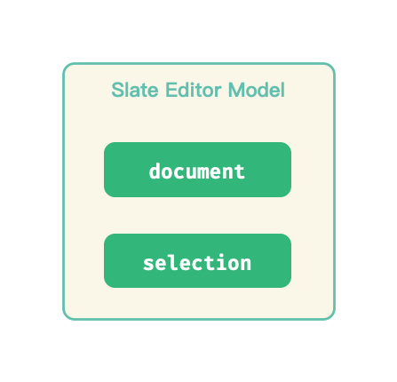
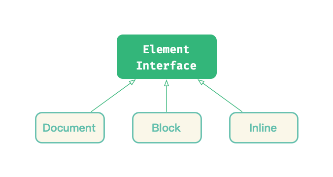

# Slate.js 中的富文本

Slate.js 在数据模型的设计宗旨是 「Mirror the DOM」，即尽可能按照现行的 DOM 标准去抽象自己的数据模型。这种亲近现行标准的设计理念，降低了开发者接入编辑器的知识负担：我熟悉 HTML ，就能很快上手 Slate.js。

我们分别从对节点和选区的设计上，看看 Slate.js 是怎么模拟 DOM 的。。

<p align="center">
  
</p>

## Node 设计

在 Slate.js 中，同样区分了：

- Node：最高级的抽象，包含了访问节点和节点内容的方法
- Element：表示节点容器的 Node。Slate.js 含有 Document、Block 和 Inline 三种类型的 Element
- Text：表示节点文本内容的 Node

### Node

<p align="center">
	
</p>

类似于 DOM，Slate.js 同样使用 Node 作为基础抽象，因此，它也需要考虑：

- **如何划分节点类型**
- **如何处理节点关系**
- **如何表示节点内容**
- **如何绑定节点数据**

一个 Node 对象含有如下属性：

- `key`：节点在当前文档中的索引
- `data`：节点绑定的数据
- `nodes`：节点的子孙
- `object`：节点类型
- `text`：这是一个计算属性，返回节点的文本内容

另外也包含一系列静态方法用于构造模型：

```js
class Node {
  static create(attrs = {}) {}
  static createList(elements = []) {}
  static createProperties(attrs = {}) {}
  static fromJSON(value) {}
  static toJSON(options = {}) {}
}
```

除了 Model，Slate 还定义了 **Node Interface** ，在当中定义了节点遍历、节点内容访问、节点规范化等能力：

```js
class NodeInterface {
  getText() {}
  getNode(path) {}
  getPath(key) {}
  normalize() {}
  validate() {}
}
```

通过 mixin 的方式，这些能力被注入到 Node Model 中：

```javascript
minxin(NodeInterface, [Document, Block, Inline, Text]);
```

### Element

<p align="center">
  
</p>

类似于 HTML Element，Slate.js 将节点类型分为：

- **Document Element**：表示编辑器的整个文档树
- **Block Element**: 表示编辑器中的块级元素
- **Inline Element**：表示了编辑器中的行内元素

Element Model 同样具有属性：

- `key`：节点在当前文档中的索引
- `data`：节点绑定的数据
- `nodes`：节点的子孙
- `object`：节点类型
- `text`：一个计算属性，返回节点的文本内容

除此之外，Element Model 中也定义了构造对象的静态方法：

```js
class Document {
  static create(attrs = {}) {}
  static fromJSON(object) {}
  static toJSON(options = {}) {}
}
```

类似于 Node Interface，Slate.js 也是通过 Element Interface 来定义 Element 具备的能力，例如修改节点，访问节点祖先等等，

```js
class ElementInterface {
  addMark(path, mark) {}

  getParent(path) {}
  getPreviousNode(path) {}
  getNextNode(path) {}
  findDescendant(predicate = identity) {}

  insertNode(path, node) {}
  removeNode(path) {}

  // ...
}
```

通过 mixin， 这些能力被注入到 Element 中：

```
mixin(ElementInterface, [Document, Block, Inline]);
```

### Text

<p align="center">
  
</p>

类似于 HTML Text，Slate.js 也定义了 Text Model 来表示节点的文本内容，它具有这些属性：

- `key`：节点在当前文档中的索引
- `object`：节点类型
- `text`：一个计算属性，返回节点的文本内容
- `leaves`: 文本叶子节点，不同格式（例如加粗，斜体等）的文本，将会被分拆为若干个 leaf
- `marks`：文本节点所包含的所有 mark（标记）

与 Node 与 Element 不同的是，Text 作为最末层抽象，能力都被内聚在了 Text Model 中。

### Mark & Leaf

在模型层，Slate.js 是通过 mark 来标记文本格式，在视图层，开发者可以通过 CSS 或者 `<strong> ` 这样的 tag 来展示格式化文本。

Slate.js 根据 mark 类型的不同，将 Text Node 拆分为了若干 Leaf。每个 Leaf 对象含有这些属性：

- `text: string`：leaf 的文本内容
- `mark: Mark`: leaf 被标记上的 mark

### Path

Slate.js 设计了 Path Model 来表示节点在节点树中的位置，它是一个数值数组，循着 Path 的每个元素，我们就能找到这个节点。下例中，`[0,1]` 就表示了 C 节点的位置：

<p align="center">
	
</p>

> `[]` 则表示了根节点的位置

## Selection 设计

### Range

<p align="center">
  
</p>

Slate.js 参考了 DOM Selection 和 DOM Range 的设计，设计了 Range Model 作为选区的基础抽象，并通过 Range Interface 注入了选区相关能力。

Range Model 也采用 `anchor`、`focus` 来描述一个片段的起终点，更进一步，Slate.js 设计了 Point 这个数据结构来描述选区位置：

- `anchor`：range 起点
- `focus`：range 终点

<p align="center">
  
</p>

另外，它还提供了额外的计算属性用于扩展选区信息：

- `end` 与 `start`：如果说 `anchor`/`focus` 是 range 的「事实」起终点，那么 `start`/`end` 则是 range 的「视觉」起/终点，`start` 总在 `end` 之前（或者二者重叠）
- `isBackward` 与 `isForward`：选区方向是向前还是向后
- `isCollapsed` 与 `isExpanded`：是否折叠
- `isSet` 与 `isUnset`：起点终点是否均被设置

### Point

在 DOM Selection 中，通过 `anchorOffset/focusOffset`和 `anchorNode/focusNode` 来标识选区的起始位置，Slate 则设计了 Point Model 来内聚 offset 和 node 信息：

<p align="center">
  
</p>

一个 Point 对象具有如下属性：

- `key`：坐落的 Text Node 的索引
- `path`：坐落的 Text Node 位置
- `offset`：在对应 Text 节点上偏移了多少字符

### Selection

Slate.js 中的 Selection 遵循了现代浏览器的设计，一个 Selection 对象不再允许含有多个 Range 对象，它含有属性：

- `anchor`：选区起点
- `focus`: 选区终点
- `isFocused`: 当前选区是否被聚焦
- `marks`：当前选区包含的文本格式（有助于我们实现格式刷/清除格式等功能）

<p align="center">
	
</p>

Selection 的能力则是通过 Range Interface 注入的。

## 总结

一方面，Slate.js 尽可能地按照现行 HTML 标准去抽象编辑器的内核模型，让传统的 Web 应用开发者更加平滑地过度到编辑器的开发中。另一方面，Slate.js 也较为克制地扩展了 HTML 的数据模型，例如设计了 Point 来表示坐标，设计了 Path 来表示节点位置等等，形成了更加语义化的抽象，梳理了选区和节点的「空间属性」。

Path 作为描述节点空间位置的模型，不仅关乎节点访问，也对后面我们会介绍的协同算法尤为重要，下一节，我们就将深入了解 Slate.js 中的 Path。
