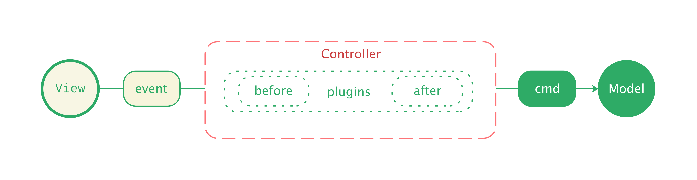
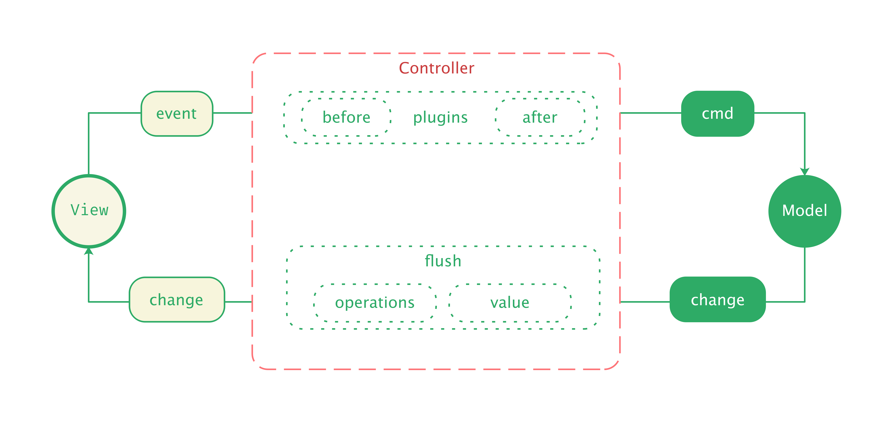
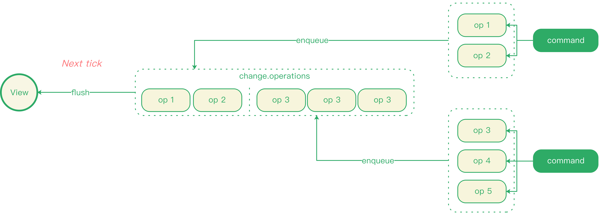
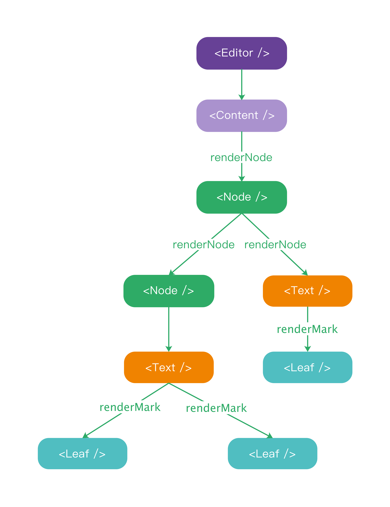
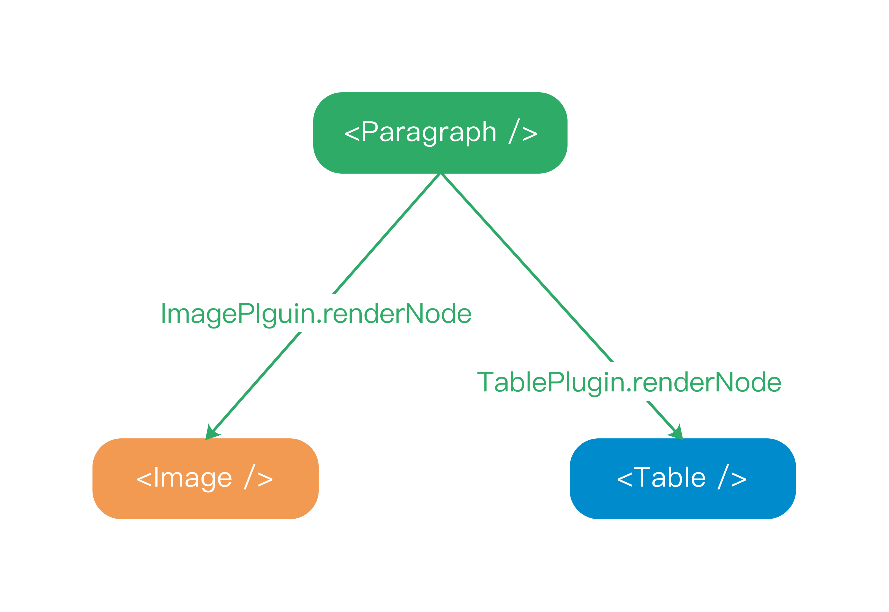
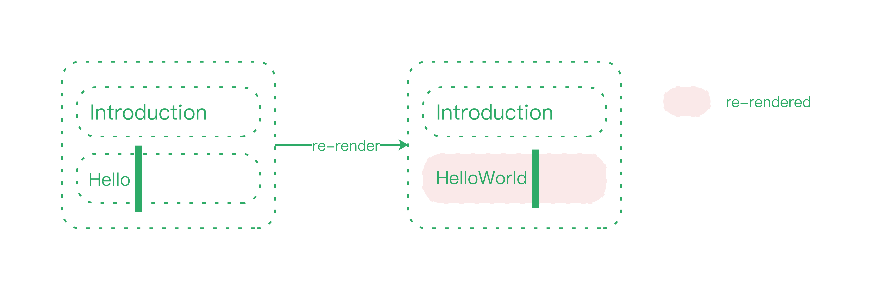
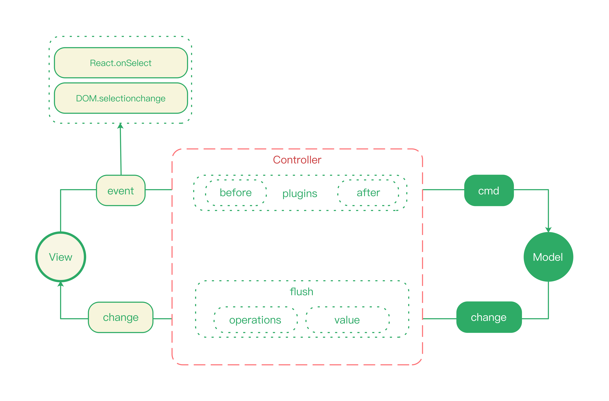

# 数据模型与视图同步

前文中，我们提到过，Slate.js 拥有一个视图无关的数据模型，这份数据模型可以接入任何视图层解决方案，无论你 React 还是 vue，当然也可以是原生的 JavaScript 和 DOM。

官方则默认提供了 slate-react —— 基于 React 的视图层解决方案。

slate-react 提供了一个顶层 React 组件 `<Editor />` 用来描述编辑器，而内容相关的组件则被拆分为 `<Content />`、`<Node />`、`<Text />` 、`<Leaf />` 等：

```jsx
<Editor>
  <Content>
    <Node />
    <Node>
      <Text>
        <Leaf />
        <Leaf />
      </Text>
    </Node>
  </Content>
</Editor>
```

## MVC

`<Editor />` 是视图层的入口，内部维护了一个编辑器 Controller 实例，用于沟通视图和内存模型，构成一个经典的  MVC 架构：

<p align="center">
  
</p>

* 核心是编辑器 Controller
* 视图层通过 Controller 修改模型
* 模型更新后，通过 Controller 倾倒变更给视图


那么，从用户按下按键开始，到用户看到输入的内容，这期间发生了什么？

### V-> C -> M：视图更新模型

当视图层接受到输入事件（beforeinput event）之后（在 React 下，就是 React 合成事件），事件最终被递交到 `<Editor />` 组件，被其中的 Controller 获得后，Controller 将事件转交到插件序列处理。值得注意的是，事件并非直接流经「开发者声明的插件序列」，而是在开始和结束处，会分别被 Slate.js 内置的 DOM Plugin 进行预处理和后置处理。所以，事件在 Slate.js 中的流转历经三个阶段：

1. **预处理**：例如当处于输入法时，要阻断 `keydown` 事件的传播
2. **自定义插件序列**：事件被预处理后，将流入开发者声明的自定义插件序列
3. **后置处理**：例如 `beforeinput` 事件最终将在文档模型中插入输入的字符

<p align="center">
  
</p>


事件流经插件过程中，插件会根据事件类型和事件携带的信息，调用编辑器「指令」更新数据模型，例如在 DOM After Plugin 中，拦截到 `beforeinput` 事件后，会根据不同的 `inputType` 调用不同的「指令」更新数据模型：

```js
function AfterPlugin(options = {}) {
  function onBeforeInput(event, editor, next) {
    // 根据不同的 `inputType` 更新数据模型
    switch (event.inputType) {
      case 'deleteByDrag':
      case 'deleteByCut':
      case 'deleteContent':
      case 'deleteContentBackward':
      case 'deleteContentForward': {
        editor.deleteAtRange(range)
        break
      }
      // ...
    }

    next()
  }
}
```

### M -> C -> V：模型渲染视图

数据模型更新后，Controller 要将新的变更对象（change）倾倒给视图，视图层通过向 `<Editor />` 组件注册的 `onChange` 回调来获得变更对象，刷新编辑器内容：

<p align="center">
  
</p>

```jsx
import { Editor } from 'slate-react'

const RichTextEditor = (props) => {
  const [value, setValue] = React.useState(DEFAULT_VALUE);
  
  return (
    <Editor
      value={value}
      onChange={(change) => setValue(change.value)}
    />
  )
}
```

倾倒新的模型到视图不是同步（立即）发生的，而是使用 Promise 封装为了一个 microtask：

```js
class Controller {
  applyOperation(operation) {
    // 异步、批量倾倒变更
    if (!this.tmp.flushing) {
      this.tmp.flushing = true
      Promise.resolve().then(() => this.flush())
    }

    return controller
  }

  flush() {
    this.run('onChange')
    const { value, operations, controller } = this
    const change = { value, operations }
    this.operations = List()
    this.tmp.flushing = false
    this.onChange(change)
    return controller
  }
}
```

<p align="center">
  
</p>

这里读者可能会有两个疑惑：

1. 为什么需要「异步调度」？
2. 为什么使用 「microtask」？

进行异步调度是因为：

* 一个 UI 事件作用到模型，可能调用了若干指令，产生了多个 Operation，若每个 Operation 的应用（apply）都进行一次视图同步，代价是十分高昂
* 单个 Operation 的应用，作用到视图，用户视觉看到的内容未必有变更，因此，Slate.js 会等到所有指令产生的 Operation 都应用完毕，再向视图倾倒新的内容。保证下一次视图变更反映的是当次用户操作的完整影响

那么为什么要选择 microtask 而不是 setTimeout 来创建 macrotask 呢？了解 Event Loop 的同学应该知道，Timer 需要在下一次渲染后才被调度。而 microtask 队列则会在下一次渲染前被调度。亦即 microtask 能让我们的操作在下一次编辑器视图更新前就被调度。

假定我们当前的 UI 状态是 A，基于 A，对文档产生了若干变更 operations，如果使用 setTimout 调度，那么到渲染后，UI 步进到下一个状态 B，才倾倒这些变更，那么有可能在 flush 发生时，携带了 B 状态产生的 op。

举个例子，我们用 `<cursor />` 描述光标，假定 UI 的初始状态为 "<cursor />"（即内容为空），连续快速输入字符 1，2，期望看到的内容是：

```jsx
12<cursor />
```

若使用 setTimeout 调度，可能的过程就会是：

```
1. input "1"
2. flush [insert_text "1"]
3. paint "<cursor />1", udapte dom selection to 1 // Slate.js 会更新 DOM 选区以匹配模型选区
4. input "2"
5. paint "1<cursor />"
6. selectionchange to 1 // DOM 选区更新，同样会刷新模型选区
7. flush [insert_text "2", set_selection 1] // 延迟到渲染之后调度，此时包含了刷新选区的 op
8. paint "1<cursor />2"
```

最终的 UI 将与用户预期不符：

```jsx
1<cursor />2
```

错误的根本原因时，第二次 flush 时：

* insert_text "2" 基于 UI 状态 "<cursor />1" 产生
* set_selection to 1 基于 UI 状态 "1<cursor />" 产生

apply 两个没有产生自相同视图上下文的 op，必然会导致状态紊乱。

而若是使用 Promise，由于 microtask 会在下一次 paint 之前调度，所以连续输入 1，2 时的过程为：

```
1. input "1"
2. flush [insert_text "1"]
3. paint "<cursor />1", update dom selection to 1
4. input "2"
5. flush [insert_text "2"] // 所有的 flush 都在 paint 之前完成
6. paint "1<cursor />2", udapte dom selection to 2
7. paint "12<cursor />"
```

使用 microtask 调度 flush，保证了：**当前倾倒的变更，都产生自相同 UI 上下文**。

## 视图的渲染

### 节点渲染

当视图层获得新的内存模型后，就尝试重新渲染内容，渲染首先从 `<Content />` 组件开始，从根节点 `document` 开始，依序渲染节点子树：

<p align="center">
  
</p>


类似 DOM，slate-react 区分了两种节点组件：

* 使用 `<Text />` 渲染 Text 节点（Text）：文本将会按照格式不同的又拆分成多个 `<Leaf />` 渲染
* 使用 `<Node />` 渲染 Element 节点（Block、Inline）

#### 容器节点 `<Node />` 的渲染： 

渲染 Block 与 Inline 时，其内容是通过调用插件声明 `renderNode` hook 所取到的，必要的上下文信息（例如 controller 等）也会被注入到该 hook：

<p align="center">
  
</p>

#### 文本节点 `<Text />` 的渲染：

渲染 Text 时，则需要根据文本的装饰序列（即时作用的 decorations）与格式序列（持久化的 marks），拆分成不同的叶子节点进行渲染，Leaf 反映了不同了格式的文本内容，其实际内容最终取决于插件声明的 `renderMark`：

<p align="center">
  
</p>


### 渲染节流

如果任何模型的变更都会重渲整棵文档树的话，代价是十分高昂的，对于此，slate-react 通过 SCU（`shouldComponentUpdate`）实现了渲染节流，只在必须的时候才会重新渲染节点，以 `<Node />` 组件为例，只有当：

1. 节点引用（`node`）变化
2. 编辑器的只读（`readOnly`）与否变化
3. 节点的选中态（`isSelected`）变化
4. 节点的聚焦态（`isFocused`）变化
5. 节点被装饰的序列（`decorations`）变化

才重新渲染节点。此外，插件也能通过实现 `shouldNodeComponentUpdate` hook，来控制节点的是否需要重渲染，`shouldNodeComponentUpdate` 具备更高的优先级。

```js
class Node extends React.Component {
  shouldComponentUpdate(nextProps) {
    const { props } = this
    const { editor } = props
    // 插件也能通过实现 `shouldNodeComponentUpdate` hook 控制节点的渲染频度
    const shouldUpdate = editor.run(
      'shouldNodeComponentUpdate',
      props,
      nextProps
    )
    const n = nextProps
    const p = props

    if (shouldUpdate != null) {
      if (shouldUpdate) {
        return true
      }
    }

    if (n.readOnly !== p.readOnly) return true

    if (n.node !== p.node) return true

    if (n.isSelected || p.isSelected) return true
    if (n.isFocused || p.isFocused) return true

    if (!n.decorations.equals(p.decorations)) return true

    return false
  }
}
```

<p align="center">
  
</p>

## 选区的同步

上面我们介绍了文档模型中数据内容的同步，选区模型的同步大抵类似：

* 监听选区事件更新模型选区
* 模型更新后，重新绘制 DOM 选区

<p align="center">
  
</p>


但值得注意的是：对于选区事件的监听，slate-react 监听了两个事件源：

* React 组件上的 `onSelect` 合成事件
* DOM 原生的 `selectionchange` 事件：由于 React 组件的 `onSelect` 并非标准实现，只有用户抬起鼠标按键时，才会回调。但是实际中，选区的变更可能不全来自鼠标事件，因此额外监听 `selectionchange` 事件保证模型选区和视图选区的同步


> 参考 Issue：https://github.com/ianstormtaylor/slate/issues/1135

## 无暇的架构？

Slate.js 这套模型视图的同步方式就是完美无缺的吗？似乎从上文的分析看挑不出毛病，但我会告诉你并不是这样的，所以在继续介绍 Slate.js 的优雅设计之前，下一章我会先扎进它的脆弱之处 —— IME （输入法），去了解这套架构背后的缺陷，以及对于这些缺陷，开发者能做什么，或者 Slate.js 又应该怎么调整。
