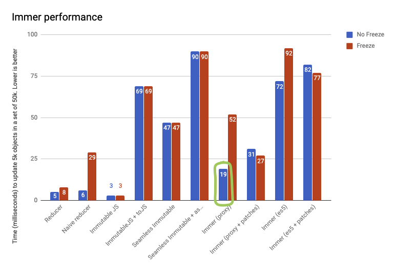

# 不可变数据

加入视图层选用 React 来渲染编辑器节点，并在 `renderNode` hook 中将节点对象注入到组件：

```jsx
const Image = Reac.memo((props) => {
  const { data } = props.node;
  const { url } = data;
  
  return (
    
  )
})
```

当属性变化时，React 是通过比较（`===`）属性引用来决定是否重新渲染组件的，如果数据被设计为了可变的，重新设置图片路径我们使用：

```js
props.node.data.url = 'https://www.new-image.png';
```

修改结束后，由于图片节点的引用没有发生变化，因此即便图片路径已经发生了变化，用户看到的还是旧的图片。

响应式程序设计这几年成为了前端应用的宠儿，除了 React， 像 Redux 这样的状态管理模型，或者 RxJS 这样的响应式任务编排，它们对于状态可预测性、变更可追溯的追求，也要求了前端应用在设计数据模型时使用 Immutable Data。

Immutable Data 除了对响应式应用程序设计天然亲和，也更加易于测试以及副作用隔离。所以对 Slate.js 做单元测试是非常方便的，不仅 Slate.js 自身受益于此，当开发者编写插件时，也非常容易拆分测试单元。

## 如何实现数据的不可变

JavaScript 对象类型是可变的，如果使用原生的 JavaScript 实现数据不可变，至少需要两个步骤：

- 创建数据对象的新版本：可以使用解构赋值或者 `Object.assign()` 来实现
- 保证对象不可直接修改：可以使用 `Object.freeze()` 实现

```js
const newObj = Object.freeze({
  ...obj,
  prop1: Object.freeze({
    ...obj.prop1,
    prop2: Object.freeze({
      ...obj.prop1.prop2,
      prop: value
    })
  })
})
```

可以发现，当被修改的属性路径较深时，使用原生 JavaScript 实现不可变数据就非常啰嗦了。

Slate.js 0.4x 版本使用了 [Immutable.js]https://immutable-js.github.io/immutable-js/() 实现 Immutable Data，它提供了高性能且丰富的 API：

```js
document.setIn(['nodes', '0', 'nodes', '1', 'data', 'src'], 'https://some-image.png')
```

Immutable.js 问题

- **侵入性**：Immutable.js 只工作在其定义的数据结构
- **学习曲线**：Immutable.js 的大量 API 也造成了陡峭的学习曲线
- **性能**：对 Immutable Data 序列化/反序列化（`fromJS()`/`toJS()`）的工作是耗时的。Immutable.js 在读性能上表现也不够好，而编辑器的数据模型却经常面对者大规模访问，例如 normalize，选区定位等
- **难于 Debug**：再不安装额外浏览器的插件的情况下，直接通过开发者工具或者控制台是很难阅读 Immutable 的数据结构

因此，Slate.js 在 0.50.x 版本后，使用了 Immer 替代了 Immutable.js。

<p align="center">
  
</p>

与 Immutable.js 构建自己的数据结构不同。Immer 会给到我们一份原始数据的 draft 版本用于修改数据，修改完成后，Immer 会用它生成一份真正的 Immutable Data 返回给我们，整个过程都是使用的原生 JavaScript 对象。

```js
import produce from "immer"

const baseState = [
    {
        todo: "Learn typescript",
        done: true
    },
    {
        todo: "Try immer",
        done: false
    }
]

const nextState = produce(baseState, draftState => {
    draftState.push({todo: "Tweet about it"})
    draftState[1].done = true
})
```


Immer 本身基于 ES6 Proxy 实现，Proxy 也带来了更好的性能：

<p align="center">
  
</p>

Immer 官网展示的 benchmark 使用了 50,000 规模的数据，并更新了其中 5000 个数据。除了原生 JavaScript 实现，Immutable.js 是最快的，其次就是 Immer，但是，实际场景中，我们的 Immtable.js 使用离不开 `toJS()` 调用，加上这个 Immutable 就比 Immer 慢了。

Immer 官方宣称实际应用中，性能会比图表反映的还要快，因为对于 “空操作（no-op）,Immer 会直接返回原始状态，在 React 应用中，这个特性将减少了组件 re-rendering 的次数。

## 参考资料

- [Immer Performance](https://immerjs.github.io/immer/docs/performance)
- [MDN - Object.freeze()](https://developer.mozilla.org/en-US/docs/Web/JavaScript/Reference/Global_Objects/Object/freeze#:~:text=A%20frozen%20object%20can%20no,existing%20properties%20from%20being%20changed.)
- [Performance: Immutable.js Map vs List vs plain JS](https://stackoverflow.com/questions/42004939/performance-immutable-js-map-vs-list-vs-plain-js)