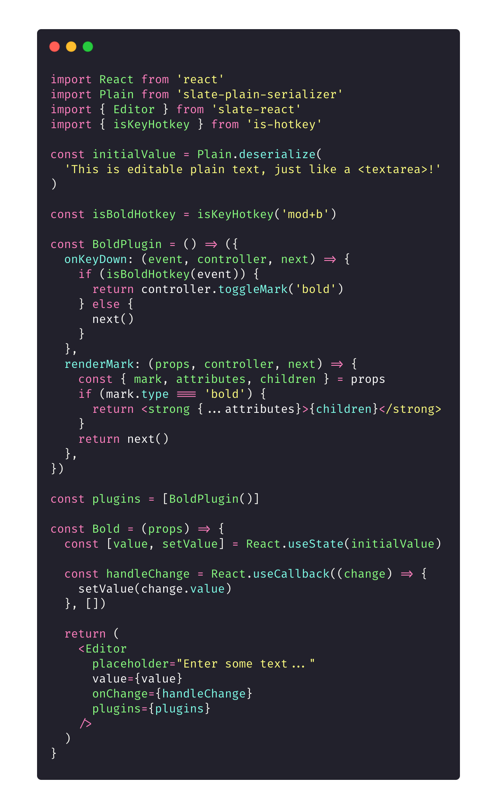
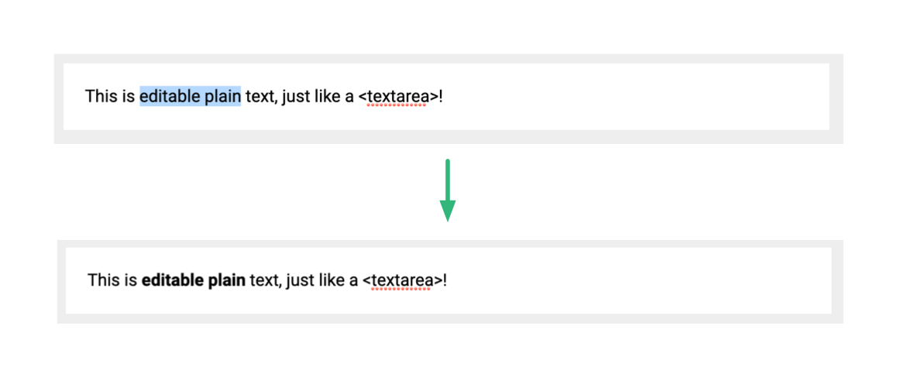
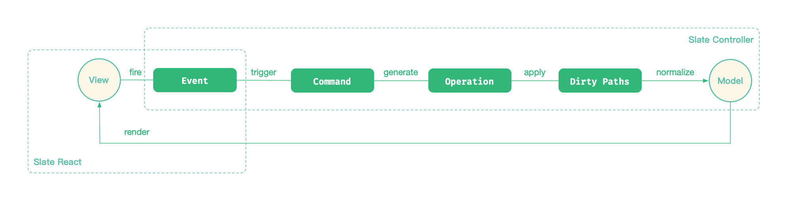

## 为什么选择 Slate.js

为什么选择 Slate.js 来学习富文本编辑器呢？主要是因为：

- 它是一个「**非常轻量**」的解决方案：它几乎没有集成任何功能，只是提供了一个扩展机制给开发者去实现想要的功能。蝇量级的内核方便读者 “见微知著”。
- 它有一个「**可以适配任何 UI**」 的内核模型：大多数Slate.js 定义了一套脱离 UI 实现的数据模型，考虑到我们不是要再学习一遍 React 或者 Vue，这也能让我们让脱离 UI 的繁文缛节，聚焦到编辑器的模型设计上。
- 它为「**协同编辑**」所设计：因为网络条件、客户端硬件、应用架构的限制，早期的一些 Web 富文本编辑器并没有考虑到多人实时协同，Slate.js 的模型设计天然就亲和协同编辑，通过学习 Slate.js，我们也能了解到基础的多人协作文档工作原理。

我们先来看一个简单地 Slate 的 Demo，这个 Demo 展示了一个支持「文本加粗」的富文本编辑器：

从用户选中一段文本，并按下「加粗」的快捷键，到最后看见「加粗的文本」:

Slate.js 通过 Controller 主导了这个过程，更具体地：

- 我们的应用程序向 Slate.js 的 Controller 「注册了一个加粗插件」

- 用户的键盘事件（Keyboard Event）被加粗插件拦截，插件通过 Controller 调用 `toggleMark` 指令（Command）
  - 指令执行过程中，「生成了类型为 `add_mark` 的操作（Operation）」
  - 操作被「应用到了（apply）」当前编辑器模型，模型数据被刷新。另外：被该操作影响的节点路径（path）都被标识为脏路径（dirty path）
- 命令执行完毕，Controller 借助于标记到的脏路径，对路径上的节点执行「normalize」，例如合并相邻文本等等
- 等到 Event Loop 调度下一次 mircro task 时，视图层负责将最新的模型数据渲染到页面，用户最终看到了加粗的文本

循着这个 Demo，后续的章节会逐步讲述：

- Slate.js 的内核模型是怎么设计的
- Slate.js 的指令系统设计
- Slate.js 为什么将指令拆解为了一个个的操作
- Slate.js 的插件系统设计
- Slate.js 如何同步模型与视图的

在介绍 Slate.js 内核模型设计之前，我们先回顾下，HTML 中是怎么样表示富文本的。